# Manuale utente

Benvenuti nel manuale utente di Raccoon for Friendica! Questa pagina contiene una spiegazione
delle principali funzionalità dell'app e intende essere una guida il più possibile esaustiva a tutto
ciò che puoi (o non puoi) fare dall'app.

## Introduzione

**Friendica** è una piattaforma social e, in quanto tale, ha tutte le funzionalità che ci si aspetta
da un software di questo tipo, in particolare permette di:

- visualizzare la timeline dei post creati da altri utenti;
- seguire un hashtag e visualizzare tutti i post che lo contengono;
- creare nuovi post di primo livello o risposte ai post di altri, o pianificarne la pubblicazione
  per un secondo momento (e modificare/eliminare i tuoi post);
- reagire con "mi piace" (o "non mi piace") ai post;
- salvare un post nei segnalibri;
- ricondividere un post;
- seguire/smettere di seguire altri utenti, visualizzare il loro profilo e iscriversi per ricevere
  notifiche sulla loro attività;
- modificare il tuo profilo e accettare/rifiutare le richieste di essere seguito;
- creare i feed personalizzati;
- visualizzare gli hashtag, post o link di tendenza (e i suggerimenti su chi seguire);
- effettuare una ricerca globale su hashtag, post o utenti;
- disattivare o bloccare gli utenti per filtrare i contenuti indesiderati (e annullare tutte queste
  azioni);
- segnalare post e utenti agli amministratori, ecc.

Oltre a ciò, Friendica può vantare una serie di caratteristiche interessanti che lo distinguono da
altre piattaforme federate simili:

- permette di pubblicare post lunghi e formattati (con una sintassi basata su BBCode) e aggiungere
  un titolo o uno spoiler per ogni post;
- supporta le entità "gruppo" di ActivityPub, ovvero tipi speciali di account che ricondividono
  automaticamente tutti i contenuti dove sono menzionati agli abbonati e si comportano in maniera
  simile a quella di un forum;
- implementa il concetto di gruppi definiti dall'utente o _cerchie_, che possono essere utilizzati
  anche come destinatari per la pubblicazione (in uscita) e non solo come timeline personalizzate
  (in ingresso);
- messaggi diretti: permette di inviare direttamente un messaggio ad uno degli utenti che segui ed
  avere una conversazione privata;
- galleria foto: permette di caricare foto e organizzarle in album, inoltre puoi inserire gli
  allegati facilmente nei tuoi post selezionandoli dal catalogo;
- calendario eventi: permette di creare eventi e renderli visibili ai tuoi seguaci oppure
  visualizzare gli venti che sono stati condivisi con te;
- supporta la citazione di post all'interno di altri post (ovvero il _cross-posting_);
- permette di importare feed RSS in modo da poterli seguire come account normali e ricondividere
  i loro post;
- permette di delegare la gestione di un account ad uno o più altri account e creare in modo molto
  semplice degli account indipendenti associati al tuo;
- e, ovviamente, [molto altro ancora](https://friendi.ca/about/features).

È possibile accedere a tutte queste funzionalità utilizzando l'interfaccia web ufficiale, tuttavia
sono disponibili (per molte di queste) anche una serie di API pubbliche che possono essere
richiamate da app di terze parti.

Questo è esattamente quello che fa Raccoon: utilizza le API per creare un client pensato per
i dispositivi mobile. Dal momento che utilizza (principalmente) le API Mastodon esposte dal
backend, l'app è compatible anche con le istanze Mastodon (e le funzionalità specifiche di Friendica
non verranno visualizzate).

!!! warning "Disclaimer: funzionalità non implementate"

    Le seguenti funzionalità sono implementate parzialmente o non sono implementate a causa della
    mancanza di supporto a client di terze parti:

    - creazione eventi nel calendario;
    - partecipazione ai sondaggi;
    - creazione account / cancellazione account;
    - delega gestione ad altri utenti o accesso ad account delegati;
    - ricondivisione dei post importati da feed RSS;
    - ricondivisione automatica dei post degli utenti seguiti;
    - strumenti di moderazione per amministratori (accesso a segnalazioni ricevute, eliminazione
      contenuti, ban utenti, ecc.).

    Per accedere a tali funzionalità sarà necessario utilizzare l'interfaccia web, ad eccezione dei
    sondaggi che non sono ancora supportati (si tratta di
    un [problema](https://github.com/friendica/friendica/issues/11093) noto).

    Questo avviso non significa in assoluto che queste funzioni non saranno mai supportate. Ad esempio,
    all'inizio l'app non era in grado di mostrare le immagini inserite all'interno del corpo dei post,
    ma gli sviluppatori del backend hanno fatto un lavoro straordinario e hanno modificato la risposta
    dell'API in modo da permettere a qualsiasi app (non solo Raccoon!) di visualizzarle correttamente.

## Struttura generale della UI

L'interfaccia utente dell'applicazione è divisa in tre parti:

- il menu laterale di navigazione (accessibile dall'icona hamburger nell'angolo in alto a sinistra o
  con uno swipe da sinistra a destra): se hai effettuato l'accesso mostra il tuo nome utente e
  l'istanza cui sei connesso oppure, in modalità anonima, mostra semplicemente il nome dell'istanza —
  seguito da una serie di scorciatoie a diverse sezioni dell'app (es. le impostazioni o la
  informazioni sull'istanza attuale);
- la barra di navigazione inferiore, con le scorciatoie per le sezioni più importanti dell'app
  (Timeline, Esplora, Notifiche e Profilo), visibile solo nelle schermate di primo livello;
- il contenuto principale, solitamente strutturato nel seguente modo:
  - barra superiore contenente:
    - icona di navigazione (hamburger o pulsante Indietro) nell'angolo a sinistra;
    - il titolo della schermata;
    - (opzionale) una o più azioni nell'angolo a destra o il menu a scomparsa "⋮";
  - il contenuto della schermata;
  - una barra inferiore (opzionale, ad esempio gli strumenti di formattazione e/o un campo di
    inserimento testo).

Tutti i componenti utilizzati provengono dal design system [Material 3](https://m3.material.io/).

## Timeline

La sezione Timeline contiene una serie di post che appartengono a uno degli elenchi predefiniti
o personalizzati.

Esistono tre tipi di elenchi predefiniti:

- **Locale** (ovvero post che sono stati creati o ricondivisi sull'istanza a cui sei connesso);
- **Tutti** (ovvero post provenienti dalla tua istanza più tutte le istanze federate);
- **Iscrizioni** (solo se hai effettuato l'accesso: post creati o ricondivisi dagli account che stai
  seguendo oppure contenenti uno o più hashtag che stai seguendo).

Gli elenchi personalizzati, d'altra parte, possono essere:

- una delle [liste definite da te](#cerchie);
- un canale, ovvero le aggregazioni predefinite come "Per te", "Scopri", "Seguaci", "Immagini", ecc.
  (specifico di Friendica);
- uno dei gruppi che segui (specifico di Friendica);

Ogni elemento nella timeline ha la seguente struttura:

- indicazione di ricondivisione o risposta (l'utente che ha ricondiviso e l'autore del post
  originale);
- autore del post (immagine profilo, nome visualizzato e nome utente);
- data di creazione;
- titolo (solo sui tipi di istanze che lo permettono, ad es. Friendica o Lemmy);
- testo dello spoiler (opzionale);
- contenuto testuale (visibile senza spoiler o quando lo spoiler è espanso);
- allegati (video o immagini, opzionali);
- scheda di anteprima (contenuto aggiuntivo o URL esterno).

Se un post contiene degli hashtag sarà possibile aprire per ognuno di essi
l'[elenco dei post che lo contengono](#elenco-post-contenenti-un-hashtag), se invece
contiene delle menzioni sarà possibile aprire la schermata [profilo](#profilo-utente) corrispondente.

Utilizzando i pulsanti presenti nella parte inferiore è possibile effettuare le seguenti
interazioni sul post:

- creare un post di risposta;
- ricondividerlo (boost);
- aggiungerlo ai preferiti;
- mettere "non mi piace" (solo su Friendica)
- aggiungerlo ai segnalibri.

e visualizzare il numero di risposte/ricondivisioni o se il post è presente nei tuoi
segnalibri o meno.

Infine, a partire da ogni post è possibile:

- accedere al [profilo](#profilo-utente) di tutti gli utenti coinvolti (autore, autore della
  ricondivisione o autore originale);
- entrare nella schermata di [dettaglio post](#dettaglio-post);
- aprire il menu di azione a scomparsa per:
  - condividerlo tramite il meccanismo del sistema;
  - copiare il suo URL negli appunti;
  - copiare il titolo e il contenuto negli appunti;
  - silenziare l'autore a tempo indeterminato o per un periodo di tempo limitato;
  - bloccare l'autore;
  - segnalare il post o il suo autore agli amministratori per la moderazione;
  - citarlo (ovvero effettuare il cross-post, solo su Friendica);
  - aprire una schermata "Dettagli" con il codice sorgente e una serie informazioni aggiuntive;
  - modificarlo o cancellarlo (solo se l'autore sei tu);
  - tradurre il contenuto del post se è in una lingua diversa da quella attuale (sperimentale);
  - aggiungere una [scorciatoia](#scorciatoie) all'istanza cui appartiene (se diversa da quella
    attuale).

  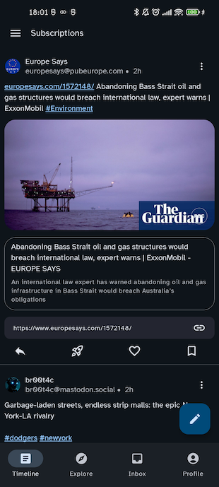
  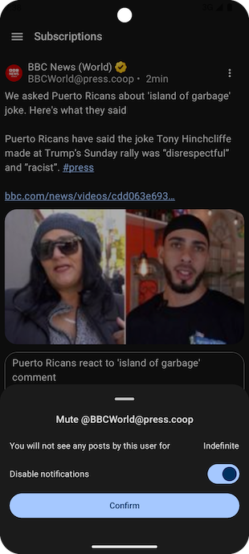

## Dettaglio post

Questa schermata permette di visualizzare un post nel suo contesto (ovvero tutti i post
precedenti fino a quello radice da cui è si originata la conversazione e tutte le risposte
ricevute).

Inoltre, è possibile visualizzare l'elenco degli utenti che lo hanno ricondiviso o aggiunto ai
preferiti.

Comunque, questa schermata è molto simile ad una normale [timeline](#timeline) e consente di
eseguire le stesse azioni su post (reazioni e menu opzioni a scomparsa), nonché aprire i profili
utente o il dettaglio di altri post della conversazione.

Se il dettaglio post viene aperto da una timeline (Home, Esplora, Preferiti, Segnalibri, contenuto
lista, lista post contenenti hashtag, dettaglio utente) sarà possibile navigare al post precedente o
al successivo con gesti di scorrimento orizzontale.

  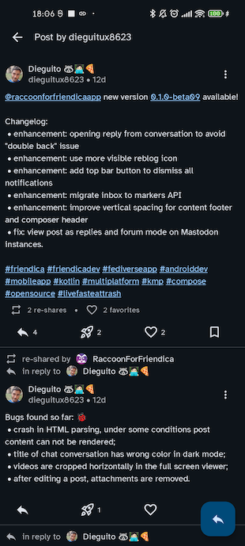

## Dettaglio immagine

A partire da un video o un'immagine allegata è possibile aprire il visualizzatore a schermo intero.
Per le immagini, fai doppio tap per accedere alla modalità "pinch to zoom".

Dal menu azioni della barra superiore, è possibile scaricare l'allegato sul tuo dispositivo,
condividerlo come file o come URL e, per le immagini, regolare le proporzioni nel caso in cui non
venissero visualizzate correttamente.

  

## Profilo utente

Lo scopo del profilo utente è visualizzare informazioni su un utente specifico e accedere
all'insieme dei contenuti che ha creato. Sono disponibili due versioni di questa schermata:
la _modalità classica_ (per account individuali) e la _modalità forum_ (per account di gruppo).

### Modalità classica {: modalita-classica }

Questa schermata si compone di due parti:

- un'intestazione che mostra nome visualizzato, nome utente, immagine profilo e immagine di
  copertina, il numero di seguaci/seguiti (da da cui è possibile aprire la lista utenti), biografia
  e una serie di campi personalizzati;
- l'elenco dei post creati dall'utente, suddiviso nelle seguenti sezioni:
  - **Post** elenco dei post di primo livello creati dall'utente;
  - **Post e risposte** tutti i post comprese le risposte creati dall'utente;
  - **Media** ovvero post contenenti allegati multimediali;
  - **Fissati** ovvero i post fissati dall'utente sul proprio profilo;

Ciascun elemento di questi elenchi ti consente di accedere al
relativo [dettaglio post](#dettaglio-post).

Se hai effettuato l'accesso, l'intestazione mostrerà la tua relazione con questo utente:

- **Reciproci** (se vi seguite a vicenda);
- **Segui già** (se tu segui l'utente ma non segue te);
- **Ti segue** (se l'utente ti segue ma tu non lo segui);
- **Richiesta inviata** (se hai inviato una richiesta di seguirlo in attesa di approvazione);
- **Richiesta in attesa** (se hai ricevuto una richiesta di essere seguito in attesa di
  approvazione);
- nessuna relazione.

Se segui l'utente, vedrai anche lo stato delle notifiche (abilitate o disabilitate) sulla sua
attività.

Dal menu a scomparsa nella barra superiore è inoltre possibile:

- bloccare/sbloccare l'utente;
- silenziare (specificando per quanto tempo) e de-silenziare l'utente;
- segnalare l'utente agli amministratori;
- aggiungere una nota personale;
- passare alla [modalità forum](#modalita-forum) (se si tratta di un gruppo).

  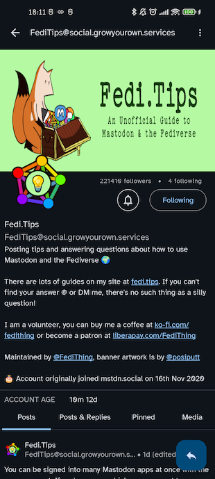

### Modalità forum { :modalita-forum }

In modalità forum vengono presentati tutti i post di primo livello che sono stati
ricondivisi dal gruppo, che possono essere interpretati come l'elenco degli argomenti del forum.
Si tratta di un tipo speciale di timeline da cui, facendo tap su ciascuno elemento sarà possibile
accedere al [dettaglio discussione](#dettaglio-discussione).

Dal menu a scomparsa nella barra superiore, è inoltre possibile passare
alla [modalità classica](#modalita-classica).

  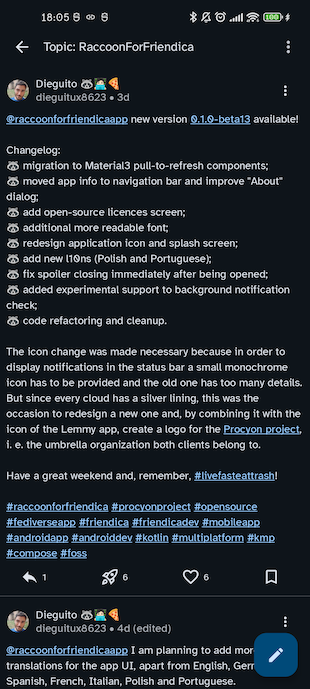

## Dettaglio discussione

Questa schermata è molto simile a un [dettaglio post](#dettaglio-post) ma i commenti vengono
visualizzati con un layout in stile Lemmy, ovvero con un rientro a sinistra variabile in base al
loro livello di annidamento e con una barra colorata che rende più facile individuare le relazioni
di discendenza tra ogni post e le sue risposte.

  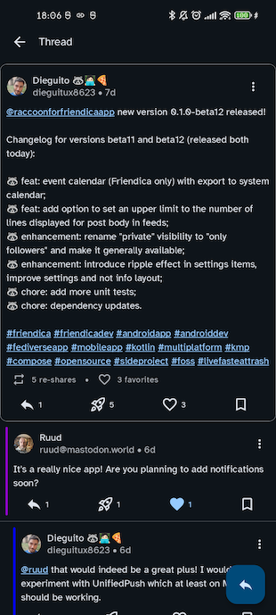

## Elenco post contenenti un hashtag

L'elenco post contenenti un hashtag è un tipo speciale di [timeline](#timeline) che consiste
nell'aggregazione di tutti i post con all'interno determinato hashtag. Per il resto, questa
schermata ha la stessa struttura di una timeline.

Dalla barra superiore è possibile seguire (o smettere di seguire) l'hashtag in questione.

  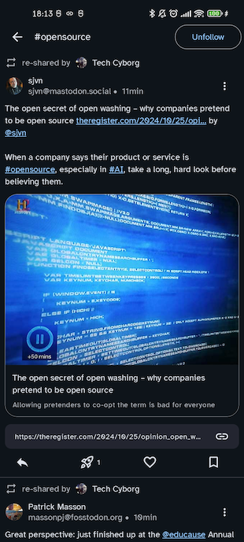

## Preferiti & segnalibri

I preferiti e i segnalibri sono tipi speciali di [timeline](#timeline) e hanno in tutto e per tutto
la stessa struttura delle timeline.

L'unica differenza è che, se un post viene rimosso dai preferiti o dai segnalibri rispettivamente,
esso scomparirà immediatamente dall'elenco.

  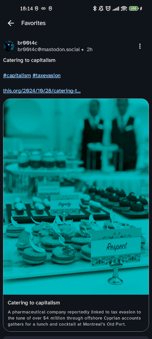
  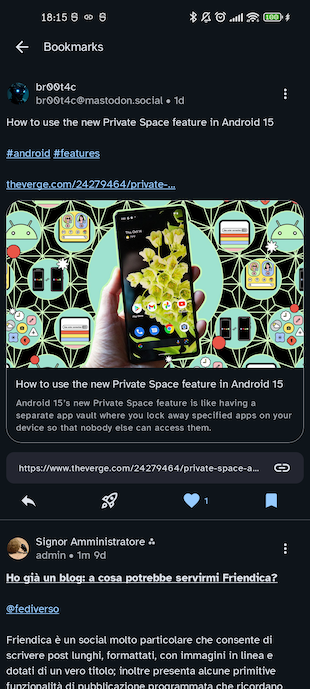

## Hashtag seguiti

Questa schermata contiene l'elenco di tutti gli hashtag seguiti in ordine alfabetico e permette di
smettere di seguirli.

Ciascun elemento di questa lista permette di aprire
l'[elenco post](#elenco-post-contenenti-un-hashtag) associato.

  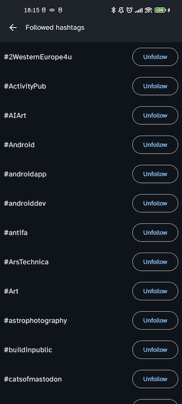

## Esplora

A partire da questa sezione è possibile vedere i contenuti di tendenza nell'istanza a cui sei
connesso. La schermata è suddivisa nelle seguenti sezioni:

- **Hashtag** contiene l'elenco degli hashtag di tendenza, con il numero di persone che ne parlano
  e un grafico sul suo utilizzo nell'ultima settimana;<a href="#hashtag-usage-disclaimer">*</a>
- **Post** contenente l'elenco dei post di tendenza;
- **Link** visualizzazione aggregata degli URL utilizzati più frequentemente nei post;
- (solo per utenti registrati) **Per te** contiene l'elenco dei suggerimenti su chi seguire per il
  tuo utente.

L'apertura di un hashtag ti porterà all'[elenco dedicato](#elenco-post-contenenti-un-hashtag),
facendo tap su un post è possibile accedere al relativo [dettaglio](#dettaglio-post) e facendo tap
su un utente si aprirà il relativo [profilo](#profilo-utente). Infine, al tap su un
collegamento aprirà il browser esterno o una custom tab a seconda dell'opzione "Modalità apertura
URL" selezionata nelle [impostazioni](#impostazioni-applicazione).

* il numero di giorni per cui sono disponibili le statistiche di utilizzo può variare da 1 a 7 a
seconda della tipologia di istanza

  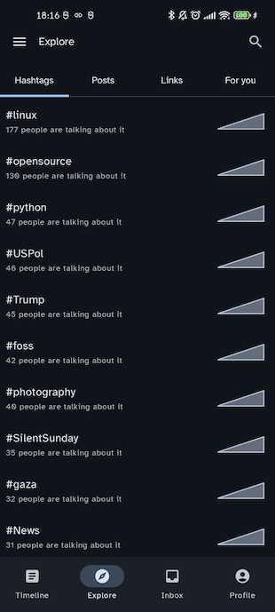
  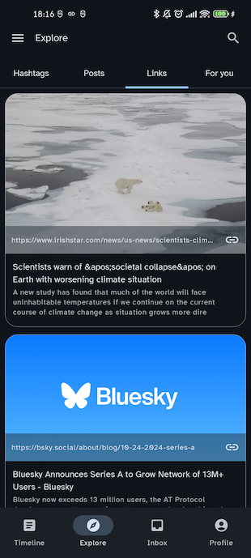

## Ricerca

Questa schermata permette di effettuare ricerche nel Fediverso: contiene un campo di ricerca per
inserire il testo da usare come criterio e un selettore a schede per selezionare il tipo di
risultato desiderato (Post, Utenti o Hashtag).

**Attenzione**: non è possibile effettuare la ricerca a meno che non sia stata inserito un
criterio non vuoto.

Facendo tap su un hashtag sarà possibile accedere al
relativo [elenco post](#elenco-post-contenenti-un-hashtag),
facendo tap su un post si aprirà il relativo [dettaglio](#dettaglio-post) e facendo tap su un utente
il [profilo](#profilo-utente) associato.

  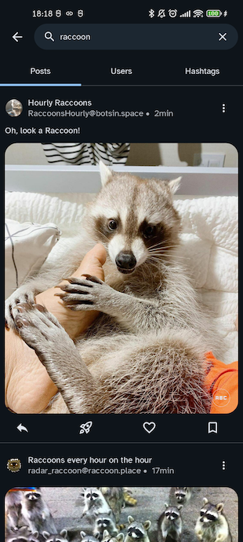

## Notifiche

Questa schermata contiene l'elenco delle notifiche per gli eventi a cui sei iscritto, ed è
disponibile unicamente per gli utenti registrati.

Il contenuto principale presenta l'elenco delle notifiche, ciascuna delle quali appartiene a una
delle seguenti categorie:

- **Post** un utente per cui hai abilitato le notifiche ha pubblicato un nuovo post;
- **Modifica** un post che hai ricondiviso è stato modificato dal suo autore;
- **Menzione** sei stato menzionato in un post;
- **Ricondivisione** uno dei tuoi post è stato ricondiviso;
- **Preferito** uno dei tuoi post è stato aggiunto ai preferiti;
- **Seguace** qualcuno ha iniziato a seguirti;
- **Richiesta di essere seguito** qualcuno ti ha inviato una richiesta di essere seguito;
- **Sondaggio** un sondaggio a cui hai partecipato è scaduto.

Dal menù della barra superiore è possibile selezionare/deselezionare specifiche categorie di
notifiche e filtrare i risultati visualizzati nell'elenco.

Inoltre, in questa schermata è possibile:

- contrassegnare tutte le notifiche come lette, semplicemente aggiornando la pagina (che azzererà il
  contatore delle non lette);
- eliminare tutte le notifiche utilizzando il pulsante "Checkmark" nella barra in alto.

**Attenzione**: dopo essere state eliminate, le notifiche verranno cancellate dal server e non sarà
più possibile visualizzarne l'elenco!

Facendo tap su ciascuna voce della lista è possibile aprire il
relativo [profilo utente](#profilo-utente) o [dettaglio post](#dettaglio-post).

  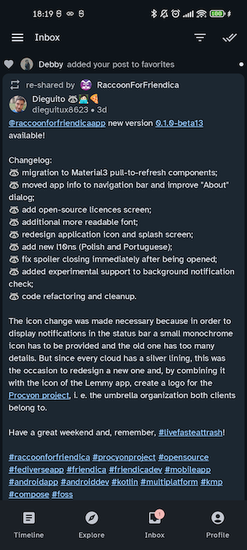

## Profilo

Se l'app è in esecuzione in modalità anonima, la schermata Profilo contiene il pulsante Accedi per
avviare il flusso di autenticazione. Se invece hai già effettuato l'accesso, verrà utilizzata una
schermata simile a un normale [profilo utente](#profilo-utente), con alcune opzioni
specifiche per azioni sul tuo account.

Se disponi di più account, nella barra superiore apparirà un pulsante "Gestisci account" per
effettuare il passaggio da uno all'altro tramite una bottom sheet.

### Login

Il metodo più comune per accedere alle piattaforme federate come Friendica o Mastodon è OAuth2,
ovvero un flusso basato sul browser grazie al quale all'app viene concesso un token temporaneo con
cui eseguire una serie di operazioni specifiche per conto dell'utente (ad esempio creare post,
seguire un utente, ottenere l'elenco dei post da chi si segue, ecc.).

Questo metodo è preferibile in quanto:

- il tuo nome utente/password non lasciano mai il browser e rimangono sconosciuti a tutti i
  soggetti terzi (inclusa l'app Raccoon);
- il livello di accesso è più granulare, il che significa che è possibile controllare i vari ambiti
  (chiamati _scope_) per cui ogni singolo token può essere utilizzato;
- i token possono essere revocati in qualsiasi momento, facilitando la mitigazione degli accessi
  potenzialmente indesiderati.

I server Friendica, d'altro canto, consentono agli utenti di autenticare le chiamate utilizzando
lo standard HTTP Basic, che richiede l'immissione delle credenziali (nome utente e password)
nell'app di terze parti che intende utilizzarle.

Il flusso di accesso prevede due tra questi passaggi:

- una schermata introduttiva dove si sceglie la piattaforma e la modalità di login (la doppia scelta
  OAuth2/HTTP Basic è disponibile solo su Friendica);
- la selezione dell'istanza (solo per OAuth2) dove specificare il server a cui connettersi — per
  Friendica è possbile scegliere da un menù a tendina o inserire manualmente il nome di dominio se
  non presente, per tutte le altre piattaforme dovrai inserire manualmente il dominio del server (ad
  es. `mastodon.social`);
- inserire il dominio dell'istanza e le credenziali (solo per HTTP Basic), dove dovrai selezionare
  la tua istanza Friendica (da un elenco a tendina o inserendolo manualmente se non presente) e
  immettere le tue credenziali.

Se non disponi di un account, è necessario prima di tutto crearlo dal sito web dell'istanza, quindi
effettuare il login nell'app mobile.

  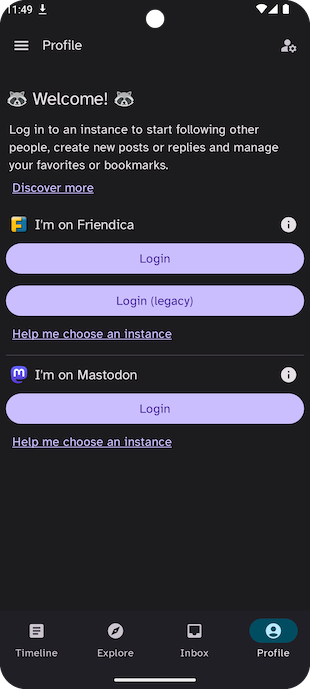
  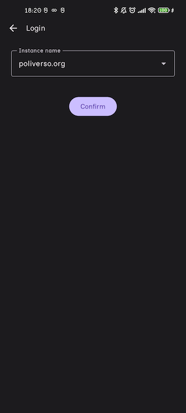
  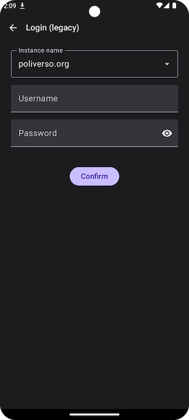

### Il tuo profilo

Come affermato in precedenza, questa schermata è molto simile a un
normale [profilo utente](#profilo-utente). Nell'intestazione, al posto del pulsante per seguire o
attivare le notifiche sarà presente un pulsante "Modifica profilo"
che permette di accedere alle [preferenze del profilo](#impostazioni-account).

  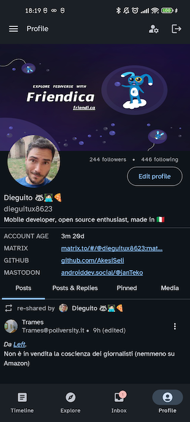

## Elenco utenti

Questa schermata contiene un elenco generico di utenti; può essere aperto sia
dal [dettaglio post](#dettaglio-post) (per visualizzare chi ha aggiunto un post ai preferiti o lo ha
ricondiviso) o dal [profilo utente](#profilo-utente) (per visualizzare chi sta seguendo o è seguito
da un determinato utente). Per ogni utente vengono mostrati l'immagine profilo, il nome visualizzato
e il nome utente, oltre al corrispondente stato di relazione con il tuo account.

Puoi utilizzare i pulsanti Segui/Invia richiesta/Reciproci per modificare la tua relazione con
questo utente.

  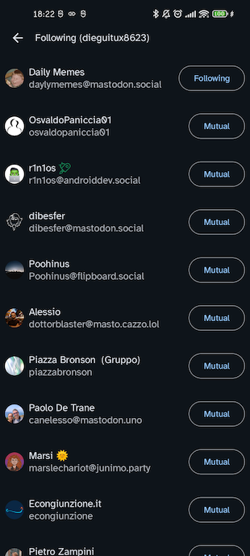

## Richieste di essere seguito

Se nelle tue [impostazioni del profilo](#impostazioni-account) hai abilitato l'approvazione manuale
per le richieste di essere seguito, questa schermata contiene l'elenco delle richieste da te
ricevute che risultano in attesa di approvazione.

Per ciascuna delle voci dell'elenco è possibile accettare o rifiutare la richiesta nonché
visualizzare il [profilo](#profilo-utente) dell'utente.

  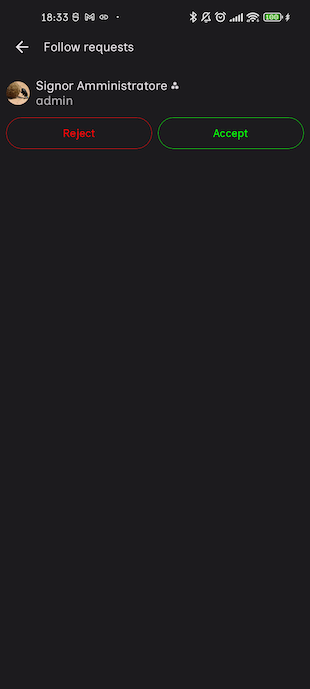

## Informazioni istanza

Questa schermata contiene una serie di informazioni relative all'istanza cui si connesso, in
particolare:

- immagine di copertina;
- nome di dominio;
- descrizione;
- contatto utente principale;
- lista di regole che devono essere rispettate dai membri dell'istanza;
- tipologia di backend e versione del software in esecuzione sul server.

  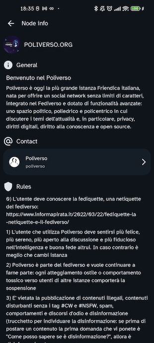

## Informazioni sull'applicazione

Questa finestra di dialogo contiene alcune informazioni aggiuntive a proposito dell'app:

- nome e codice di versione;
- link all'elenco delle modifiche;
- un pulsante per aprire un form di inserimento commenti;
- il link alla pagina principale dell'app su GitHub;
- una scorciatoia di accesso al gruppo Friendica dedicato all'app;
- un link alla room Matrix dedicata al progetto.

Inoltre, questa finestra di dialogo contiene il punto accesso a due schermate informative:

- lista delle licenze relative alle librerie e alle risorse usate nell'app;
- una pagina di Riconoscimenti che elenca tutti coloro i quali hanno contribuito all'app.

  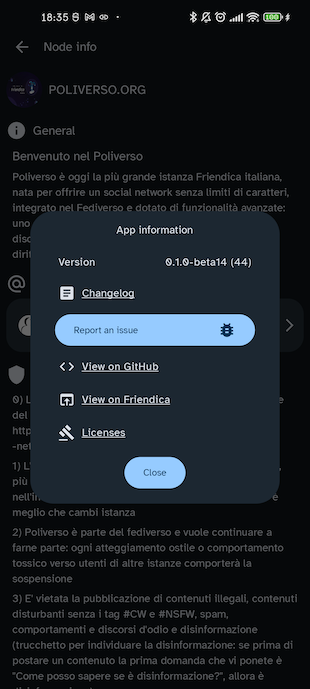
  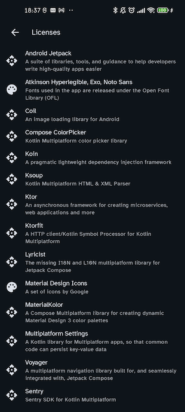

## Impostazioni account

Questa schermata ti consente di modificare i dati del tuo profilo e configurare (in una certa
misura) la rilevabilità e visibilità del tuo profilo.

I dati del profilo che possono essere modificati sono:

- nome visualizzato;
- biografia;
- immagine profilo;<a href="#user-profile-experimental-disclaimer">*</a>
- immagine copertina;<a href="#profilo-utente-disclaimer-sperimentale">*</a>
- campi personalizzati;<a href="#user-profile-experimental-disclaimer">*</a>
- bot (per contrassegnare l'account come bot);
- abilita approvazione manuale delle richieste di essere seguito (`blocked`);
- rendi l'account visibile nelle ricerche (`discoverable`);
- rendi private le liste dei seguaci e seguiti (`hide_collections`);
- includi i post creati da te nella timeline pubblica (`indexable`).

* a seconda del backend questi campi potrebbero non essere modificabili, ad es. ci sono dei
problemi di compatibilità noti in alcune versioni di Friendica

  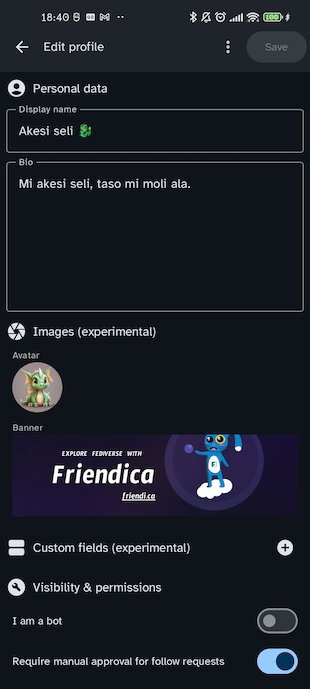

## Impostazioni applicazione

Questa schermata consente di personalizzare l'aspetto e il comportamento dell'applicazione. È
costituita dalle seguenti sezioni:

- **Generali**
  - **Lingua** configura la lingua dell'interfaccia utente;
  - **Tipo di feed predefinito** configura il tipo di elenco predefinito della schermata Timeline;
  - **Visibilità predefinita post** configura la visibilità predefinita (Pubblica, Non in lista,
    Solo seguaci o Solo menzioni) usata per i nuovi post;
  - **Visibilità predefinita risposte** configura la visibilità predefinita delle risposte;
  - **Modalità apertura URL** configura la modalità di apertura degli URL (sul browser di sistema
    oppure tramite "custom tab");
  - **Escludi risposte dalla timeline** determina se le risposte vengono incluse o meno nella
    Timeline principale;
  - **Apri i gruppi in modalità forum di default** determina se gli account di gruppo vengono aperti
    di default in modalità forum (invece che in modalità classica);
  - **Modalità caricamento immagini** permette di configurare la politica da usare per il
    caricamento delle immagini, scegliendo uno tra questi valori:
    - **Sempre** le immagini vengono caricate automaticamente indipendentemente dalla connessione di
      rete;
    - **Su richiesta** le immagini non vengono mai caricate a meno che non si utilizzi il pulsante "
      Carica" per avviare manualmente il caricamento;
    - **In WiFi** le immagini vengono caricate automaticamente se sei connesso in WiFi, su richiesta se
      stai utilizzando una connessione dati (modalità risparmio dati mobili);
  - **Markup per la composizione** determina la sintassi di formattazione per i nuovi post (Testo
    semplice — ovvero senza formattazione — BBCode — specifico di Friendica — HTML o Markdown —
    specifico di Mastodon;<a href="#markdown-formatting">*</a>
  - **Numero massimo righe testo post** configura il numero massimo di righe che verrà visualizzato
    nelle timeline per ciascun post;
  - **Modalità notifiche** permette di configurare la strategia da usare per le notifiche scegliendo
    tra i seguenti valori:
    - **Push** ricevi le notifiche push attraverso
      UnifiedPush;<a href="#notifications-unifiedpush">**</a>
    - **Pull** controlla periodicamente in background la presenza di nuove
      notifiche;<a href="#notifications-background-check">***</a>
    - **Disabilitate** le notifiche saranno ricevute all'avvio dell'app o facendo refresh della
      lista manualmente;
  - **Stato notifiche push** visualizza lo stato dell'integrazione UnifiedPush attuale (es. "Attivo"
    o "Inizializzazione…", se sul dispositivo sono disponibili più distributori la voce sarà "
    Seleziona distributore" e permetterà di aprire una bottom sheet per sceglierne uno);
  - **Controlla notifiche in background** (se la strategia selezionata è "Pull") configura
    l'intervallo di tempo tra le verifiche periodiche delle notifiche in arrivo;
- **Aspetto**
  - **Layout post** configura l'aspetto dei post nelle timeline (Completo, Compatto, Senza
    distrazioni, Scheda)
  - **Tema UI** configura il tema di colori (chiaro, scuro o scuro ottimizzato per display AMOLED);
  - **Tipo di carattere** configura il tipo di carattere usato nell'interfaccia utente;
  - **Dimensione testo** configura il fattore di scala che sarà applicato ai font nell'interfaccia
    utente;
  - **Colore tema** permette di selezionare un colore a partire dal quale verrà generata una palette
    di colori Material 3;
  - **Material You** genera una palette di colori a partire dall'immagine di sfondo;
  - **Nascondi barra di navigazione durante lo scroll** determina se la barra di navigazione
    inferiore (e la barra superiore) vengono nascoste durante lo scorrimento del contenuto interno;
  - **Icona applicazione** permette di selezionare un'icona per l'applicazione (predefinita o "
    classica");
  - **Tema barra di stato e di navigazione** permette di cambiare il tema della barra di stato
    superiore e della barra di navigazione di sistema inferiore;
- **NSFW**
  - **Gestione filtri** apre la schermata di [gestione](#gestione-filtri) degli utenti bloccati e
    silenziati;
  - **Includi contenuti NSFW** abilita un filtro lato client sui contenuti contrassegnati come
    sensibili;
  - **Offusca media NSFW** permette, se i contenuti sensibili sono inclusi, di offuscare le immagini
    e nascondere i video all'interno delle timeline.
- **Debug**
  - **Abilita segnalazioni anonime arresti anomali** determina se abilitare o meno le segnalazioni
    anonime inviate in caso di arresto anomalo per tutti gli account (affinché la modifica sia
    effettiva sarà necessario riavviare l'applicazione);
- **Altro**
  - **Esporta impostazioni** salva le impostazioni attuali in un file JSON (per poterle importare
    nuovamente se cambi account o cancelli i dati dell'applicazione);
  - **Importa impostazioni** carica le impostazioni dell'app da un file JSON;

* scegliere con cautela: <em>Markdown</em> è supportato solo da alcune versioni di Mastodon (es.
glitch-soc), se non sei sicuro/a di quel che stai facendo usa HTML o testo semplice, altrimenti i
tuoi post potrebbero non essere formattati correttamente!

** affinché UnifiedPush funzioni, sul tuo dispositivo deve essere installato un distributore, ad es.
<a href="https://unifiedpush.org/users/distributors/nextpush/">NextPush</a> che deve essere abbinato
all'app NextPush ospitata in Cloud dove hai effettuato l'accesso e configurato l'account remoto che
stati utilizzando sulla tua istanza

*** per funzionare, è necessario che all'app non sia applicata alcuna restrizione per l'attività in
background, controlla le impostazioni di risparmio energetico di Raccoon nelle impostazioni di sistema

  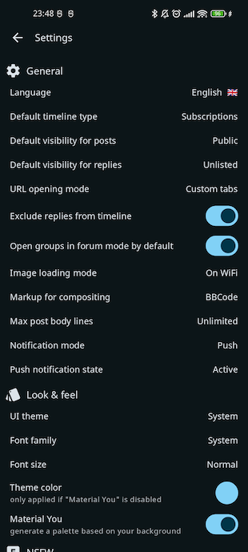
  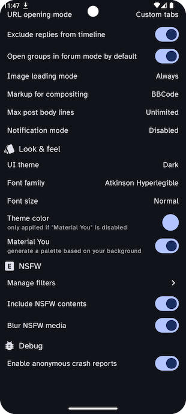

## Gestione filtri

Questa schermata consente di revocare le restrizioni (silenziare o bloccare) attualmente applicate
ad altri account. È suddivisa in due sezioni:

- **Silenziati** dedicata agli utenti che sono stati silenziati;
- **Bloccati** dedicata agli utenti bloccati;
- **Limitati** dedicata agli utenti con una quota di pubblicazione;
- **Parole** per filtri specifici basati su parole da escludere dalle timeline.

  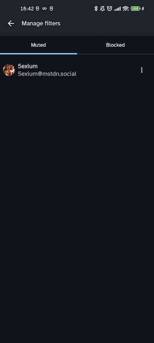

## Creazione post

Questa schermata consente di creare nuovi post o risposte. Il menu azioni nella barra superiore
contiene le seguenti voci:

- **Salva bozza** cambia il tipo di pubblicazione da immediata a bozza;
- **Imposta schedulazione** cambia il tipo di pubblicazione da immediata a schedulata;
- **Inserisci emoji** permette di inserire una emoji personalizzata;
- **Visualizza anteprima** apre un'anteprima del post (solo se l'opzione "Markup per la
  composizione"
  nelle impostazioni _non_ è "Testo semplice");
- **Aggiungi spoiler**/**Rimuovi spoiler** per aggiungere o rimuovere lo spoiler del post;
- **Aggiungi titolo**/**Rimuovi titolo** per aggiungere o rimuovere il titolo del post (solo su
  Friendica);
- **Aggiungi immagine (galleria)** aggiunge un'immagine a partire da un album della galleria
  fotografica (solo su Friendica);
- **Inserisci lista** aggiunge un elenco puntato;
- **Cambia tipo markup** permette di cambiare la sintassi di markup utilizzata per il testo
  formattato nel post corrente.

Sotto alla barra è presente un'intestazione che visualizza:

- l'indicazione dell'utente corrente (che sarà l'autore del post);
- la visibilità del post (Pubblica, Non in lista, Solo seguaci, Solo menzioni o una cerchia
  Friendica);
- la data e l'orario di schedulazione (per i post schedulati);
- il numero di caratteri attuale/numero di caratteri massimo consentito in base alle impostazioni
  dell'istanza.

Al di sotto dell'intestazione è presente il campo di testo principale per il testo del post. Nella
parte inferiore della schermata, solo se l'opzione "Markup per la composizione" nelle impostazioni
_non_ è"Testo semplice", viene mostrata una barra degli strumenti di formattazione con i seguenti
pulsanti:

- **Aggiungi immagine** per aggiungere un'immagine dal rullino foto del dispositivo come allegato;
- **Inserisci immagine nel testo** per aggiungere un'immagine dal rullino foto del dispositivo
  all'interno del testo del post (solo su Friendica);
- **Aggiungi link** per aggiungere un collegamento ipertestuale;
- **Grassetto** per inserire del testo in grassetto;
- **Corsivo** per inserire del testo in corsivo;
- **Sottolineato** per inserire del testo sottolineato;
- **Barrato** per inserire del testo sbarrato;
- **Larghezza fissa** per inserire del testo con carattere a larghezza fissa;
- **Procedi** pulsate per procedere all'invio del post che può presentare:
  - un'icona Invia per la pubblicazione immediata;
  - un'icona Salva per il salvataggio in bozze;
  - un'icona Orologio per i post schedulati.

  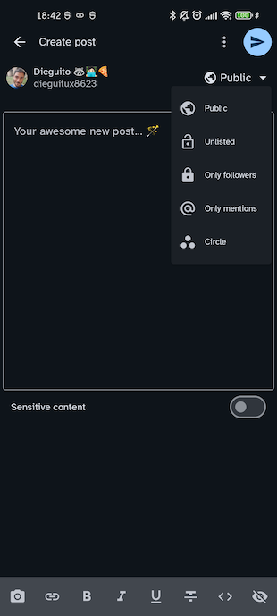

## Creazione segnalazione

Questa schermata consente di creare una segnalazione per un utente o per uno specifico post.

In alto è presente un selettore per selezionare la categoria di violazione tra:

- **Spam** il post è spam o l'utente sta inviando spam;
- **Problema legale** il post o l'utente violano alcune normative esistenti;
- **Violazione regole del server** (solo Mastodon) il post o l'utente non sta rispettando le regole
  dell'istanza (in questo caso dovrai selezionare quale regola in particolare è stata
  violata);<a href="#report-rule-disclaimer">*</a>
- **Altro** qualsiasi altro tipo di problema.

Sotto al selettore categoria, è presente un campo di testo per inserire il contenuto della
segnalazione e, infine, viene mostrato uno switch "Inoltra segnalazione" al fine di selezionare se
questo rapporto deve essere consegnato solo agli amministratori dell'istanza locale o, se stai
segnalando un contenuto proveniente da un'istanza federata, la segnalazione deve essere inoltrata
anche agli amministratori dell'istanza di origine.<a href="#report-forward-disclaimer">**</a>

* su Friendica le violazioni delle regole non sono supportate e, se questa opzione è inviata, la
richiesta viene rifiutata (con un errore 422 - unprocessable entity); pertanto questa categoria di
segnalazioni è stata nascosta

** su Friendica questo interruttore è supportato (non determina un errore 422) ma di fatto non
sembra avere alcun effetto

  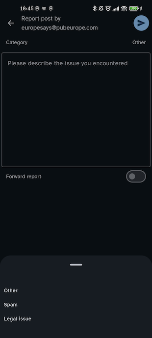

## Lascia un commento

Questo modulo consente di inviare un commento agli sviluppatori per segnalare un malfunzionamento o
suggerire delle migliorie.

Oltre al testo del commento, è possibile specificare un indirizzo email opzionale (ad esempio se
desideri essere contattato per chiarimenti).

Questo modulo è solo una schermata di utilità per coloro che preferiscono non utilizzare l'issue
tracker su GitHub (ad es. perché non hanno un account).

Attenzione: questa funzionalità può essere utilizzata solo se l'opzione "Abilita segnalazioni
anonime arresti anomali" è abilitata nella schermata [impostazioni](#impostazioni-applicazione).

  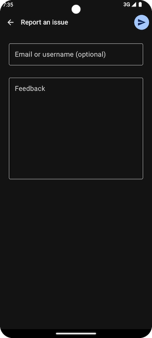

## Cerchie

Questa schermata contiene tutti i feed personalizzati che possono essere utilizzati nella timeline,
ovvero:

- gli elenchi definiti dall'utente (come liste Mastodon
  o [cerchie](https://wiki.friendi.ca/docs/groups-and-privacy) Friendica);
- i [canali](https://wiki.friendi.ca/docs/channel) Friendica;
- un elemento per ogni gruppo tra i contatti che segui.

> Il motivo per cui tutti questi elementi eterogenei si trovano nella stessa lista è perché vengono
> tutti restituiti dalla stessa API, per compatibilità con i client Mastodon.

Al fine di rendere la consultazione più facile, Raccoon suddivide in sezioni la lista, con
un'intestazione di sezione che specifica il tipo dei contenuti sottostanti.

Tra queste tre categorie, l'unica che consente di essere modificata è la prima, per la quale è
possibile utilizzare il pulsante "⋮" per:

- modificare il nome;
- eliminare la cerchia;
- visualizzare i contatti che ne fanno parte e aggiungerne di nuovi (con il pulsante "+") o
  rimuovere quelli esistenti.

Va tenuto presente che in Friendica, come impostazione predefinita, tutti i contatti che non sono di
tipo gruppo vengono aggiunti alla cerchia "Amici" mentre tutti i contatti di tipo gruppo vengono
aggiunti alla cerchia "Gruppi". Pur essendo create in automatico dal sistema, "Amici" e "Gruppi"
sono cerchie normalissime che possono essere modificate o eliminate.

Facendo tap su ogni voce della lista cerchie, verrà aperta la lista dei post corrispondenti, ovvero:

- la [modalità forum](#modalita-forum) per i gruppi;
- una timeline dedicata per tutte le altre cerchie.

  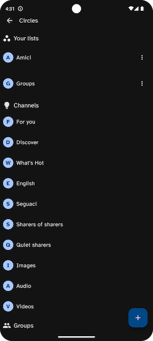
  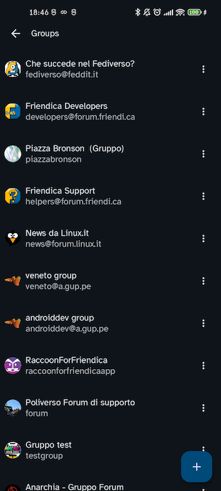

## Messaggi diretti (solo Friendica)

Questa sezione contiene l'elenco delle conversazioni private con i tuoi contatti. Per ciascuna
voce nell'elenco, vengono visualizzati:

- immagine profilo del contatto, nome utente e nome visualizzato;
- titolo della conversazione (per impostazione predefinita il primo messaggio);
- le prime righe dell'ultimo messaggio;
- numero totale di messaggi;
- tempo trascorso dalla ricezione dell'ultimo messaggio.

Facendo tap su ciascuna voce è possibile aprire il dettaglio conversazione, che ha l'aspetto di una
chat tradizionale a "fumetti" con un campo di testo nella parte inferiore dello schermo per inviare
nuovi messaggi.

Da notare che i messaggi vengono scaricati man mano che arrivano finché questa schermata è aperta,
altrimenti sarà necessario fare refresh manualmente sull'elenco delle conversazioni.

  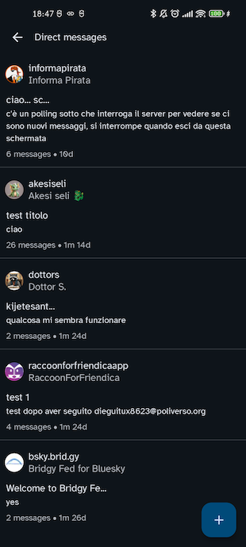
  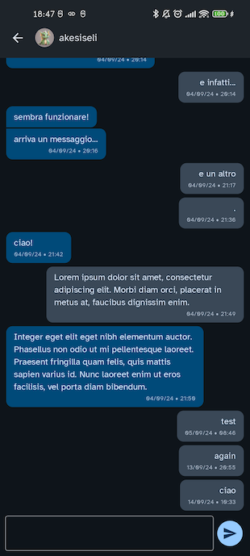

## Galleria (solo Friendica)

Questa schermata contiene l'elenco degli album presenti nella tua galleria multimediale. Per ogni
album è possibile modificare il nome, eliminarlo oppure, facendo tap sulla corrispondente voce
dell'elenco, accedere alle immagini in esso contenute.

Per ogni immagine all'interno di un album è possibile:

- modificare la descrizione;
- eliminarla dalla galleria;
- spostarla in un altro album.

  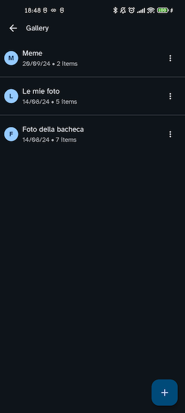
  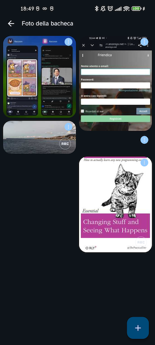

## Elementi da pubblicare

Questa schermata contiene tutte le voci in attesa di pubblicazione ed è suddivisa in due sezioni:

- **Schedulati** ovvero l'elenco dei post per cui è impostata una schedulazione;
- **Bozze** ovvero l'elenco delle bozze da te create;

ogni elemento può essere eliminato oppure, facendo tap sulla corrispondente voce dell'elenco, aperto
in modalità modifica.

**Attenzione**: nella maggior parte dei casi i post programmati <u>non</u> possono essere modificati
tranne che per la data di pianificazione, quindi il modo consigliato di salvare un post e
modificarlo per in un secondo momento è:

- creare un post con visibilità "Solo menzioni" (`direct`) senza menzionare alcun utente in modo
  che sia visibile solo a te;
- creare una bozza, tenendo presente che le bozze sono solo **record locali** salvati
  nel database dell'applicazione e non vengono archiviati da nessuna parte in remoto, quindi li
  perderai se cambi dispositivo o cancelli i dati di Raccoon.

  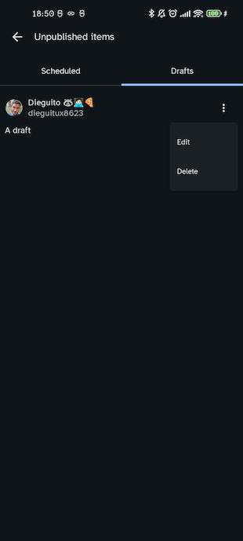

## Calendario (solo Friendica)

In questa schermata viene visualizzato il calendario degli eventi, ovvero l'elenco di tutti eventi
condivisi con te suddivisi per mese con, per ciascuna voce:

- titolo dell'evento;
- data di inizio;
- (opzionale) data di fine;
- (opzionale) posizione.

È possibile esportare ogni eventi nel calendario del tuo dispositivo mobile e, facendo tap
sugli elementi della lista, accedere alla schermata di dettaglio in cui verranno visualizzati
maggiori dettagli(ad es. una descrizione più estesa).

  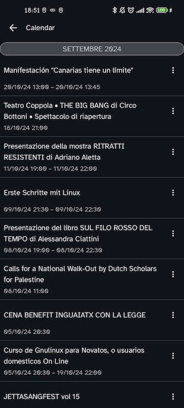
  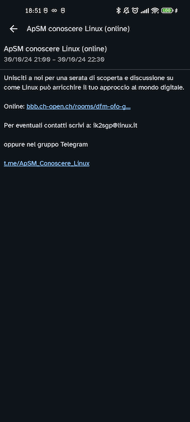

## Annunci (solo Mastodon)

Questa schermata permette di visualizzare la lista degli annunci pubblicati dagli amministratori
dell'istanza.

Per ogni elemento di questa lista, viene visualizzato:

- un indicatore "non letto" (se il messaggio è nuovo);
- il contenuto testuale dell'annuncio;
- la lista delle reazioni degli utenti;
- la data di pubblicazione.

Ogni volta che viene fatto un refresh della pagina, gli elementi non letti verranno contrassegnati
come letti.

Puoi fare tap su una delle reazioni esistenti per incrementare il contatore di 1, oppure puoi
utilizzare il pulsante "+" per aggiungere una nuova reazione. Se fai una seconda volta tap sulla
tua reazione, questa verrà rimossa e di conseguenza il contatore verrà decrementato di 1.

  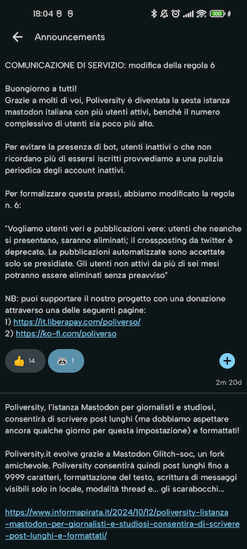

## Scorciatoie

Questa schermata presenta una lista delle scorciatoie verso istanze esterne che sono state aggiunte
dal menu a tendina dei post. Utilizzando il pulsante "⋮" è possibile rimuovere gli elementi dalla
lista.

Facendo tap su ognuno di essi, verrà invece visualizzata la timeline dell'istanza corrispondente. La
schermata è in tutto e per tutto simile a una normale [timeline](#timeline) ma, ogni qualvolta
si effettua un'interazione (ad es. aggiungere ai preferiti o ai segnalibri), il post viene
"convertito" nel riferimento corrispondente sull'istanza attuale e l'azione ha effetto su
quest'ultimo (ragion per cui le operazioni potrebbero richiere un po' più di tempo).

  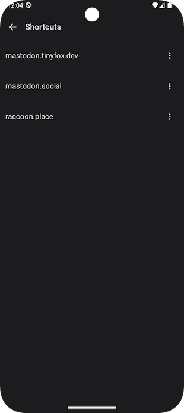
  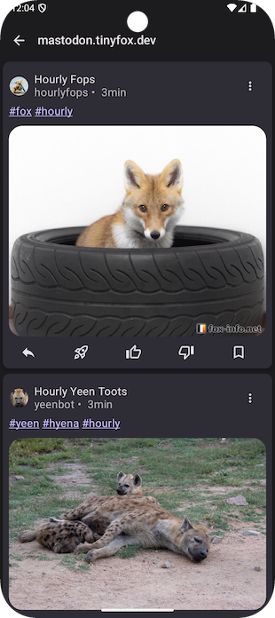

