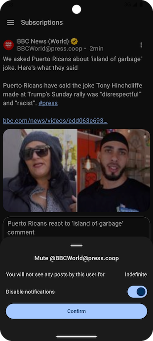
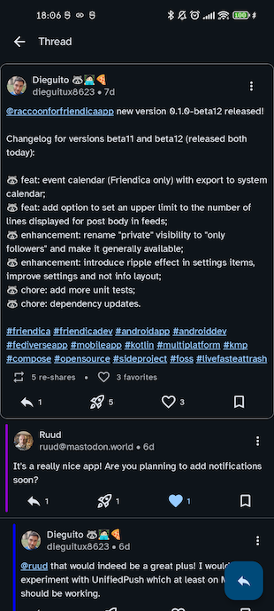
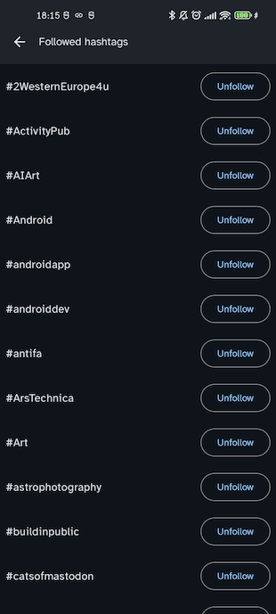
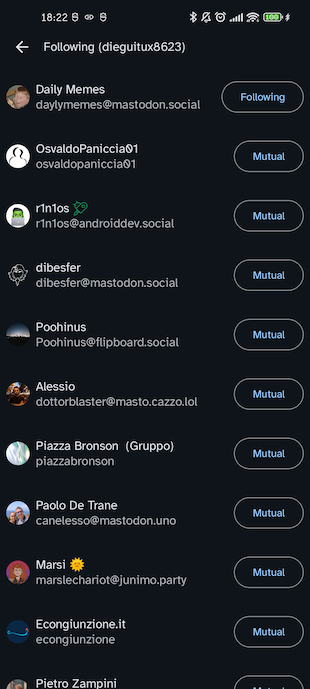
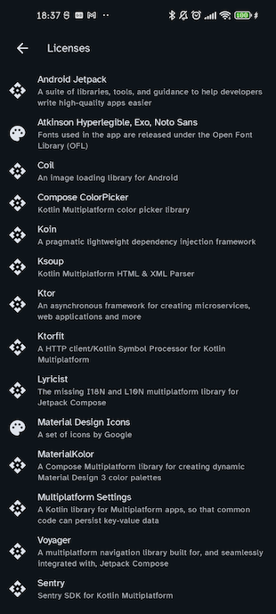
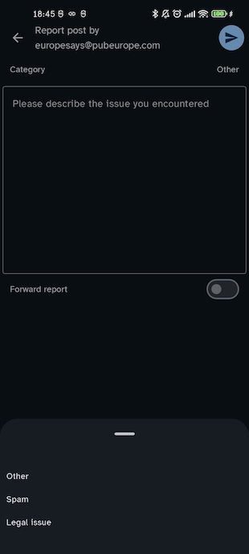
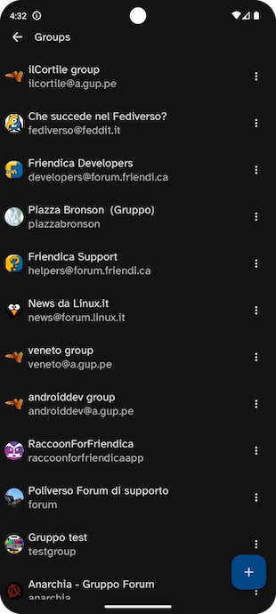
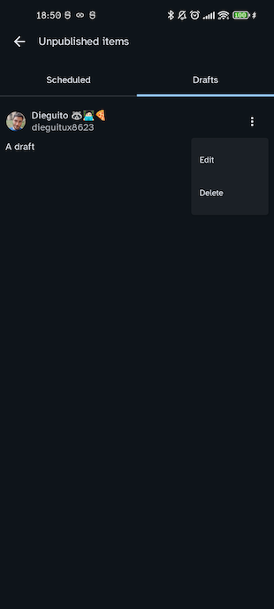
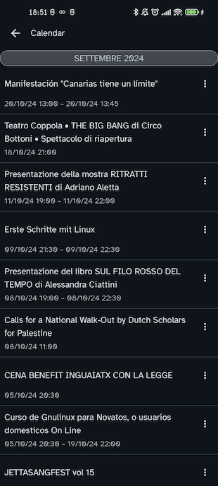

Lingua: <a href="../en/main.md">🇬🇧</a>

# User manual

Benvenuto nel manuale utente di Raccoon for Friendica! Questa guida contiene una spiegazione delle
principali funzionalità dell'app e intende essere una guida il più possibile esaustiva a tutto
ciò che puoi (o non puoi) fare dall'app.

## Indice

- [Introduzione](#introduzione)
- [Struttura generale della UI](#struttura-generale-della-ui)
- [Timeline](#timeline)
- [Dettaglio post](#dettaglio-post)
- [Dettaglio immagine](#dettaglio-immagine)
- [Profilo utente](#profilo-utente)
  - [Modalità classica](#modalità-classica)
  - [Modalità forum](#modalità-forum)
- [Dettaglio conversazione](#dettaglio-discussione)
- [Elenco post contenenti un hashtag](#elenco-post-contententi-un-hashtag)
- [Preferiti & segnalibri](#preferiti--segnalibri)
- [Hashtag seguiti](#hashtag-seguiti)
- [Esplora](#esplora)
- [Ricerca](#ricerca)
- [Notifiche](#notifiche)
- [Profilo](#profilo)
  - [Login](#login)
  - [Il tuo profilo](#il-tuo-profilo)
- [Elenco utenti](#elenco-utenti)
- [Richieste di essere seguito](#richieste-di-essere-seguito)
- [Informazioni istanza](#informazioni-istanza)
- [Informazioni sull'applicazione](#informazioni-sullapplicazione)
- [Impostazioni account](#impostazioni-account)
- [Impostazioni applicazione](#impostazioni-applicazione)
- [Gestione filtri](#gestione-filtri)
- [Creazione post](#creazione-post)
- [Creazione segnalazione](#creazione-segnalazione)
- [Cerchie](#cerchie)
- [Messaggi diretti](#messaggi-diretti-solo-friendica)
- [Galleria](#galleria-solo-friendica)
- [Elementi da pubblicare](#elementi-non-pubblicati)
- [Calendario](#calendario-solo-friendica)

## Introduzione

**Friendica** è una piattaforma social e ha tutte le funzionalità che ci si aspetta da un software
di questo tipo, in particolare ti permette di:

- visualizzare la timeline dei post creati da altri utenti;
- seguire un hashtag e visualizzare tutti i post che lo contengono;
- creare nuovi post di primo livello o risposte ai post di altri, o pianificarne la pubblicazione
  per un secondo momento (e modifica o eliminare i tuoi post);
- mettere "mi piace" o "non mi piace" ai post;
- salvare un post nei segnalibri;
- ricondividere un post;
- seguire o smettere di seguire altri utenti, visualizzare il loro profilo e iscriversi per ricevere
  notifiche sulla loro attività;
- modificare il tuo profilo e accettare/rifiutare le tue richieste di essere seguito;
- creare i feed personalizzati;
- visualizzare gli hashtag, post o link di tendenza (e i suggerimenti su chi seguire);
- effettuare una ricerca globale su hashtag, post o utenti;
- disattivare o bloccare gli utenti per filtrare i contenuti indesiderati (e annullare queste
  azioni);
- segnalare post e utenti agli amministratori, ecc.

Oltre a ciò, Friendica ha una serie di caratteristiche interessanti che lo distinguono da altre
piattaforme federate simili:

- puoi pubblicare post lunghi e formattati (con una sintassi basata su BBCode) e aggiungere un
  titolo o uno spoiler per ogni post;
- supporta le entità "gruppo" di ActivityPub, ovvero tipi speciali di account che ricondividono
  automaticamente tutti i contenuti dove sono menzionati agli abbonati e si comportano in maniera
  simile a quella di un forum;
- integra il concetto di gruppi definiti dall'utente o _cerchie_, che possono essere utilizzati
  anche come destinatari per la pubblicazione (in uscita) e non solo come timeline personalizzate
  (in ingresso);
- messaggi diretti: puoi inviare direttamente un messaggio ad uno degli utenti che segui ed avere
  una conversazione privata;
- galleria fotografica: puoi caricare foto e organizzarle in album, inoltre puoi inserire gli
  allegati facilmente nei tuoi post selezionandoli dal catalogo;
- calendario eventi: puoi creare eventi e renderli visibili ai tuoi seguaci oppure visualizzare gli
  eventi che sono stati condivisi con te;
- supporta la citazione di post all'interno di altri post (ovvero il _cross-posting_);
- ti permette di importare feed RSS in modo da poterli seguire come account normali e ricondividere
  i loro post;
- puoi delegare la gestione di un account ad uno o più altri account e creare in modo molto semplice
  degli account indipendenti associati al tuo;
- ovviamente, [molto altro ancora](https://friendi.ca/about/features).

È possibile accedere a tutte queste funzionalità utilizzando l'interfaccia web ufficiale, ma sono
disponibili (per molte di queste) anche una serie di API pubbliche che possono essere richimate da
app di terze parti.
E questo è esattamente quello che fa Raccon: utilizzare le API in modo da essere client per
Friendica pensato per facilitarne l'utilizzo da dispositivo mobile.

[Torna su](#indice)

## Struttura generale della UI

L'interfaccia utente dell'applicazione è divisa in tre parti:

- il menu laterale di navigazione (accessibile dall'icona hamburger nell'angolo in alto a sinistra o
  con un gesto swipe da sinistra a destra), contiene il tuo nome utente e istanza, se hai effettuato
  l'accesso, o semplicemente il nome dell'istanza in modalità anonima e una serie di scorciatoie a
  diverse sezioni dell'app (es. le impostazioni o la informazioni sull'istanza attuale);
- la barra di navigazione inferiore, che contiene le scorciatoie per le sezioni più importanti
  dell'app (Timeline, Esplora, Notifiche e Profilo), visibile solo nelle schermate di livello
  superiore;
- il contenuto principale che solitamente è strutturato nel seguente modo:
  - una barra superiore contenente:
    - un'icona di navigazione (l'hamburger o il pulsante Indietro) nell'angolo a sinistra;
    - il titolo della schermata;
    - una o più azioni (facoltative) nell'angolo a destra o nel menu a scomparsa "⋮";
  - il contenuto dello schermo;
  - una barra inferiore, opzionale (ad esempio la barra degli strumenti di formattazione e/o un
    campo di inserimento testo).

Tutti i componenti utilizzati provengono dal design system [Material 3](https://m3.material.io/).

[Torna su](#indice)

## Timeline

La sezione Timeline contiene una serie di post che appartengono a uno degli elenchi predefiniti
o personalizzati.

Ci sono tre tipi di elenchi predefiniti

- Locale (ovvero post che sono stati creati o ricondivisi sull'istanza a cui sei connesso);
- Tutti (ovvero post provenienti dalla tua istanza più tutte le istanze federate);
- Iscrizioni (solo se hai effettuato l'accesso: post creati o ricondivisi dagli account che stai
  seguendo oppure contenenti uno o più hashtag che stai seguendo).

Gli elenchi personalizzati, d'altra parte, possono essere:

- una delle tue liste personali;
- un canale, ovvero le aggregazioni predefinite come "Per te", "Scopri", "Seguaci", "Immagini", ecc.
  (specifico su Friendica);
- uno dei gruppi che segui (specifico su Friendica);

Ogni elemento nella timeline ha la seguente struttura:

- indicazione di ricondivisione o risposta (l'utente che ha ricondiviso o l'autore del pot originale
  se quello corrente è una risposta);
- autore (immagine profilo, nome visualizzato e nome utente);
- data di creazione;
- titolo (solo da server che lo permettono, come Friendica o Lemmy);
- testo dello spoiler (facoltativo);
- contenuto testuale (visibile senza spoiler o quando lo spoiler è espanso);
- allegati (video o immagini);
- scheda di anteprima (contenuto aggiuntivo o URL esterno).

Se un post contiene un hashtag sarà possibile aprire
l'[elenco dei post che lo contengono](#elenco-post-contententi-un-hashtag), se invece
contiene una menzione potrai aprire la schermata[profilo](#profilo-utente) corrispondente.

Ogni post può essere ricondiviso, aggiunto ai preferiti o aggiunto ai segnalibri; puoi creare una
risposta e visualizzare il numero di risposte / ricondivisioni o se esso è presente nei tuoi
segnalibri o meno.

Inoltre per ogni singolo post è possibile:

- accedere al [profilo](#profilo-utente) di tutti gli utenti coinvolti (autore della riconsidivzione
  o autore originale);
- entrare nella schermata di [dettaglio post](#dettaglio-post);
- aprire il menu di azione a scomparsa per:
  - condividerlo tramite il meccanismo del sistema;
  - copiare il suo URL negli appunti;
  - copiare il titolo e il contenuto negli appunti;
  - silenziare l'autore a tempo indeterminato o per un periodo di tempo limitato;
  - bloccare l'autore;
  - segnalare il post o il suo autore agli amministratori per la moderazione;
  - citarlo (ovvero effettuare il cross-post, solo su Friendica);
  - aprire una schermata "Dettagli" con il codice sorgente e una serie informazioni aggiuntive;
  - modificalo o cancellalo (solo se l'autore sei tu).

  
  

[Torna su](#indice)

## Dettaglio post

In questa schermata permette di visualizzare un post nel suo contesto (ovvero tutti i post
precedenti fino a quello radice da cui è originata la conversazione e tutte le risposte che ha
ricevuto).

Inoltre puoi visualizzare l'elenco degli utenti che lo hanno ricondiviso o aggiunto ai preferiti.

Per il resto, questa schermata è molto simile ad una normale [timeline](#timeline) e consente di
eseguire le stesse azioni su post e aprire profili utente o il dettaglio di altri post.

  

[Torna su](#indice)

## Dettaglio immagine

Da un video o un'immagine allegata è possibile aprire il visualizzatore di immagini a schermo
intero. Per le immagini, fai doppio tap per accedere alla modalità "pinch to zoom".

Dal menu azioni della barra superiore, è possibile scaricare l'allegato sul tuo dispositivo,
condividerlo come file o come URL e, per le immagini, regolare le proporzioni nel caso in cui non
venissero visualizzate correttamente.

  

[Torna su](#indice)

## Profilo utente

Lo scopo del profilo utente è visualizzare informazioni su un utente specifico e accedere
all'insieme dei contenuti di cui è l'autore. Sono disponibili due versioni di questa schermata:
la _modalità classica_ (per account individuali) e la _modalità forum_ (per account di gruppo).

### Modalità classica

Questa schermata si compone di due parti

- un'intestazione con il nickname, il nome utente, l'imagine profilo e l'imamgine di copertina, il
  numero di seguaci/seguiti (da da cui è possibile aprire la lista utenti), la biografia e una serie
  di campi personalizzati;
- l'elenco dei post creati dall'utente, con le seguenti sezioni:
  - **Post** elenco dei post di primo livello dell'utente;
  - **Post e risposte** tutti i post comprese le risposte dell'utente;
  - **Media** ovvero post contenenti allegati multimediali;
  - **Fissati** ovvero i post fissati dall'utente sul proprio profilo;

Ciascun elemento di questi elenchi ti consente di accedere al
relativo [dettaglio post](#dettaglio-post).

Se hai effettuato l'accesso, l'intestazione mostrerà la relazione che il tuo utente ha con questo
accont:

- Reciproci (se vi seguite a vicenda);
- Segui già (se tu segui l'utente ma non segue te);
- Ti segue (se l'utente ti segue ma tu non lo segui);
- Richiesta inviata (se hai inviato una richiesta di seguirlo in attesa di approvazione);
- Richiesta in attesa (se hai ricevuto una richiesta di essere seguito in attesa di approvazione);
- nessuna relazione.

Se segui l'utente, vedrai anche lo stato della notifica (abilitata o disabilitata).

Dal menu a scomparsa nella barra superiore, è inoltre possibile:

- bloccare/sbloccare l'utente;
- silenziare/de-silenziare l'utente (e specificare per quanto tempo);
- segnalare l'utente;
- aggiungere una nota personale;
- passare alla [modalità forum](#modalità-forum) (se si tratta di un gruppo).

  

### Modalità forum

In modalità forum, verranno presentati tutti i post di primo livello che sono stati
ricondivisi dal gruppo, ovvero l'elenco degli argomenti di questo forum.
Si tratta di un tipo speciale di timeline, toccando ciascuno elemento sarà possibile accedere
al [dettaglio discussione](#dettaglio-discussione).

Dal menu a scomparsa nella barra superiore, è inoltre possibile passare
alla [modalità classica](#modalità-classica).

  

[Torna su](#indice)

## Dettaglio discussione

Questa schermata è simile a un [dettaglio post](#dettaglio-post) ma i commenti vengono visualizzati
con un layout in stile Lemmy, cioè con l'indentazione (rientro a sinistra) variabile in base al loro
livello di annidamento e con una barra colorata che rende più facile individuare le relazioni di
discendenza tra un post e le risposte.

  

[Torna su](#indice)

## Elenco post contententi un hashtag

L'elenco post di un hashtag è un tipo speciale di [timeline](#timeline) che aggrega tutti i post
contenenti un determinato hashtag, di fatto questa schermata ha in tutto e per tutto la stessa
struttura di una timeline

Dalla barra superiore è possibile seguire o smettere di seguire l'hashtag in questione.

  

[Torna su](#indice)

## Preferiti & segnalibri

I preferiti e i segnalibri sono tipi speciali di [timeline](#timeline) di fatto hanno la medesima
struttura.

L'unica differenza è che se rimuovi un post dai preferiti o dai segnalibri, questo
scomparirà immediatamente dall'elenco.

  
  

[Torna su](#indice)

## Hashtag seguiti

Questa schermata contiene l'elenco di tutti gli hashtag che segui in ordine alfabetico e
ti permette di smettere di i singoli hashtag.

Ciascun elemento di questa lista permette di aprire il
relativo [elenco post](#elenco-post-contententi-un-hashtag).

  

[Torna su](#indice)

## Esplora

Questa sezione ti consente di vedere i contenuti di tendenza nell'istanza a cui sei connesso. La
schermata è suddivisa nelle seguenti sezioni:

- **Hashtag** contiene l'elenco degli hashtag di tendenza, con il numero di persone che ne parlano
  e un grafico sul suo utilizzo nell'ultima settimana;<a href="#hashtag-usage-disclaimer">*</a>
- **Post** elenco dei post di tendenza
- **Link** visualizzazione aggregata degli URL utilizzati più frequentemente nei post;
- (solo per utenti registrati) **Per te** contiene l'elenco dei suggerimenti su chi seguire per il
  tuo utente.

L'apertura di un hashtag ti porterà all'[elenco dedicato](#elenco-post-contententi-un-hashtag),
facendo tap su un post è possibile accedere al relativo [dettaglio](#post-dettaglio) e facendo tap
su un utente si aprirà il relativo [profilo](#profilo-utente). Invece, al tap su un
collegamento aprirà il browser esterno o una custom tab a seconda dell'opzione "modalità di
apertura URL" selezionata nelle [impostazioni](#impostazioni-applicazione).

  * su server diversi il numero può variare da 1 a 7 giorni a seconda del tipo di istanza

  
  

[Torna su](#indice)

## Ricerca

This screen makes it possible to search in the Fediverse: it contains a search field to enter the
query string and a tab selector to choose the desired result type (either Posts, Users or Hashtags).

Please notice that it is not possible to search unless a non-empty query has been inserted.

Opening a hashtag will lead you to the [dedicated feed](#hashtag-feed), opening a post to
its [detail](#post-detail) and opening a user to the corresponding [profile](#user-profile).

  

[Torna su](#indice)

## Notifiche

This screen contains the list of notifications for the events you have subscribed to, so it is only
available for logged users.

The main content presents the list of notifications, which can be of the following types:

- **Post** a user you enabled notifications for has published a new post;
- **Edit** a post you have re-shared has been modified by its author;
- **Mention** you have been mentioned in a post;
- **Re-share** one of your posts has been re-shared;
- **Favorite** one of your posts has been added to favorites;
- **Follow** someone has started following you;
- **Follow request** someone has sent you a follow request;
- **Poll** a poll you have participated in has expired.

From the top bar menu it is possible to select/unselect specific categories of notifications to
filter the results displayed in the list.

Moreover, it is possible to:

- mark all notifications as read, by simply refresh the page (which will reset the unread counter);
- dismiss all notifications by using the "Done all" button in the top bar.

(Be careful, after being dismissed notifications are cleared from the server and you will not be
able to browse the list any more!)

Tapping on each item of the list, it is possible to open the [user profile](#user-profile)
or [post detail](#post-detail).

  

[Torna su](#indice)

## Profilo

If you are running the app in anonymous mode, the Profile screen contains the Login button to start
the authentication flow. If, on the other hand, you are already logged in, it looks similar to a
regular [user profile](#user-profile) but has some additional actions specific for your user.

If you have multiple accounts, in the top app bar you will find a "Manage account" button to switch
between one another.

### Login

The most common way to log-in to federated platforms like Friendica or Mastodon is OAuth2, i.e. a
web-based flow thanks to which the app is granted a token to perform a set of specific operations on
behalf of the user (e.g. creating posts, follow a user, get the subscription timeline).

This method is recomended because:

- your username/password never go outside browser and remain unknown to all third-party subjects
  (including the Raccoon app);
- it has finer-grained access levels, meaning you can control the various _scopes_ each individual
  token can be used for;
- tokens can be revoked at any time, making it easier to mitigate potentially unwanted accesses.

Friendica back-ends, in turn, allow users to authenticate calls using the Basic HTTP standard, which
requires users credentials (username and password) to be known to the third-party app using it.

The login flow involves two steps:

- an introductory screen where you choose your platform and login mode (the double choice
  OAuth2/HTTP Basic is only available on Friendica)
- the instance selection (only for OAuth2) where you have to specify the server to connect to; for
  Friendica you have the possibility to choose from a drop-down menu or you can manually enter the
  domain, for all other platforms you will have to manually enter the server domain (
  e.g. `mastodon.social`);
- the instance and credentials input (only for HTTP Basic) where you have to select your Friendica
  instance (from a drop-down list or entering it manually) and insert your credentials.

  
  
  

### Il tuo profilo

In the header, instead of the relationship/notification buttons you will find an "Edit profile"
button to open your [profile preferences](#profile-settings).

  

[Torna su](#indice)

## Elenco utenti

This screen contains a generic list of users; it can be opened either from
the [post detail](#post-detail) (to see who added a post to favorites or re-shared it) or from
the [user profile](#user-profile) (to see who is following or followed by a given user). It displays
the avatar, display name and username of users plus the corresponding relationship status.

You can use the follow/send request/mutuals button to modify your relationship with the given
account.

  

[Torna su](#indice)

## Richieste di essere seguito

If in your [profile settings](#profile-settings) you have enabled manual approval for follow
requests, this screen contains the list of pending follow request you have received.

For each one of the items you can either accept or reject the request.

  

[Torna su](#indice)

## Informazioni istanza

This screen contains some information about the current instance you are connected to:

- banner image;
- domain;
- description;
- contact account;
- list of rules members of this server have to comply with;
- backend type and software version.

  

[Torna su](#indice)

## Informazioni sull'applicazione

This dialog contains more information about the app:

- version name and code;
- a link to the changelog;
- a button to open a feedback form;
- a link to the GitHub main page of the app;
- a shortcut to the Friendica discussion group for the app;
- a link to the project's Matrix room;
- the entry point for the list of licences for the libraries and resources used in the app.

  
  

[Torna su](#indice)

## Impostazioni account

This screen allows you to edit your profile data and configure (to some extent) the discoverability
and visibility of your profile.

The profile data which can be edited are:

- display name;
- bio;
- avatar;<a href="#user-profile-experimental-disclaimer">*</a>
- banner;<a href="#user-profile-experimental-disclaimer">*</a>
- custom fields;<a href="#user-profile-experimental-disclaimer">*</a>
- bot (mark account as bot);
- manual approval of follow requests (`locked`);
- make account visible in searches (`discoverable`);
- make following and follower lists private (`hide_collections`);
- include posts by this account in public timeline (`indexable`).

  * depending on the back-end type these fields may not work, e.g. there are some known compatibility
issues on some versions of Friendica

  

[Torna su](#indice)

## Impostazioni applicazione

This screen allows to customize the application appearance and behaviour, it has the following
sections:

- **General**
  - **Language**  configures the language for the user interface;
  - **Default timeline type** configures the timeline type used by default in the Timeline screen
  - **Default visibility for posts** configures the visibility (`public`, `unlisted`, `private` -
    i.e. only followers — or `direct` — i.e. ony mentions) used for posts by default;
  - **Default visibility for replies** configures the visibility used for replies by default;
  - **URL opening mode** configures how URLs will be opened (external browser or custom tabs);
  - **Exclude replies from timeline** configures whether replies are included by default in the
    Timeline screen;
  - **Open groups in forum mode by default** configures whether group accounts are going to be
    opened in forum mode (as opposed to classic mode) by default;
  - **Load images automatically** if enabled, images are loaded automatically, if disabled images
    are loaded on-demand (data saving mode);
  - **Markup for compositing** determines the type of markup syntax used in new posts (plain text —
    i.e. no markup — BBCode — Friendica-specific — HTML or Markdown — Mastodon specific);*
  - **Max post body lines** configures the maximum number of lines for posts which will be shown in
    feeds;
  - **Notification mode** allows to configure the notification strategy among the following values:
    - **Push** receive push notifications using
      UnifiedPush;<a href="#notifications-unifiedpush">*</a>
    - **Pull** periodically check in background for incoming
      notifications;<a href="#notifications-background-check">**</a>
    - **Disabled** no notification will be received;
  - **Push notification state** displays the state of the UnifiedPush integration (e.g. "Enabled"
    or "Initializing…", if more than a distributor is available on the device the "Select
    distribution" value will allow to open a bottom sheet to pick one);
  - **Check for notifications in background** (if "Pull" strategy selected) configures the time
    interval between background checks for incoming notifications;
- **Look & Feel**
  - **UI theme** configures the color theme (light, dark or dark optimized for AMOLED screens);
  - **Font family** configures the font used in the UI;
  - **Font size** configures the scale factor applied to fonts in the UI
  - **Theme color** allows to choose a color to generate a Material 3 palette from;
  - **Material You** generate a color palette based on the launcher image;
- **NSFW**
  - **Manage filters** opens the ban and [filter management](#manage-filters) screen;
  - **Include NSFW contents** configures a client-side filter to exclude sensitive posts;
  - **Blur NSFW media** allows, if sensitive contents are included, to blur images and hide videos
    when they occur in timelines.

  * in order for UnifiedPush to work, a distributor must be installed on your device, e.g.
<a href="https://unifiedpush.org/users/distributors/nextpush/">NextPush</a> and configured with the
corresponding server-side Nextpush app where you have, in turn, registered and paired with the
remote account you are currently using on your instance 

  ** in order to this to work, the application must not have any restriction for background activity,
so please make sure the battery saving restrictions for Raccoon in your system settigs

  

[Torna su](#indice)

## Gestione filtri

This screen allows to revoke current restrictions on other accounts. It is divided into two
sections:

- **Muted** for muted accounts;
- **Bans** for banned ones.

  

[Torna su](#indice)

## Creazione post

This screen allows to create new posts or replies. The top bar contains the Submit button which can
have different icons depending on the publishing type:

- a Send icon for regular publication;
- a Save icon for drafts;
- a Schedule icon for scheduled posts;

whereas the action menu contains the following items:

- **Save draft** changes the publishing type from regular to draft;
- **Set schedule** changes the publishing type from regular to scheduled posts;
- **Insert emoji** allows to insert a custom emoji;
- **Open preview** opens a preview of the post (only if "Markup for compositing" option in Settings
  is
  _not_ plain text);
- **Add title**/**Remove title** to add or remove a title for the post;
- **Add image (media gallery)** adds an image from an album in the Friendica media gallery;
- **Insert list** adds an itemized list;
- **Add spoiler**/**Remove spoiler** (only if "Markup for compositing" option in Settings is plain
  text) to add or remove a spoiler for the post;
- **Add image** (only if "Markup for compositing" option in Settings is plain text) adds an image
  from
  the device gallery;

Below the top bar there is a header containing:

- an indication of the current user (who will be the author of the post);
- the visibility (`public`, `unlisted`, `private`, `direct` or a Friendica circle);
- the schedule date and time (for scheduled posts);
- the current character count / character limit according to instance configuration.

Below the header you can find the main text field for the post body. In the bottom part of the
screen, only if "Markup for compositing" option in Settings is _not_ plain text, you will find a
formatting toolbar with the following buttons:

- **Add image** to add an image from the device gallery;
- **Add link** to add a hyperlink
- **Bold** to insert some text in bold;
- **Italic** to insert some text in italic;
- **Underline** to insert some underlined text;
- **Strikethrough** to insert some text with a strikethrough effect;
- **Code** to insert monospaced font;
- **Toggle spoiler** to add or remove a spoiler for the post.

  

[Torna su](#indice)

## Creazione segnalazione

This screen allows to create a report for either a user or a specific post.

It contains a selector to choose the kind of violation among:

- **Spam** the post is spam or user is spamming;
- **Legal** issue the post or user infringes some existing legislation;
- **Rule** (Mastodon-only) the post or user does not follow the instance rules (in this case you
  will have to select which rule is violated);<a href="#report-rule-disclaimer">*</a>
- **Other** any other kind of issue.

Below you can write the report body in a text field and, finally, the "Forward report" switch allows
you to select whether this report should only be delivered to your instance admins or, if you are
reporting a content coming from a federated instance, it should be handled by the admins of the
source instance too.<a href="#report-forward-disclaimer">**</a>

* on Friendica rule violation are not supported yet and if they are submitted they get rejected by
the server, so this option is hidden

** on Friendica this switch is supported (does not cause the request to be rejected by the server)
but it has no effect

  

[Torna su](#indice)

## Lascia un commento

This form allows you to submit your feedback to the developers. Apart from writing your comment, you
can optionally specify an email address (e.g. if you wish to be contacted for clarifications). This
is just a utility screen for those who prefer not to use the issue tracker.

  

[Torna su](#indice)

## Cerchie

This screens contains all the custom feeds that can be used in the timeline, which comprise:

- user-defined lists (like Mastodon lists or
  Friendica [circles](https://wiki.friendi.ca/docs/groups-and-privacy));
- Friendica [channels](https://wiki.friendi.ca/docs/channel);
- one item for each group among the accounts you follow.

> The reason why all these heterogeneous elements are in the same list is because they are all
> returned by the same API for compatibility with Mastodon clients.

Among these three categories, the only one which allow to be modified is the first one, for which:

- you can use the "more" button to edit the name or delete it
- you can enter a circle detail screen to see the contacts that belong to it.

Please remember that in Friendica by default all non-group contacts are added to the "Friends"
circle and all group contacts are added to "Group" but, albeit being there by default, these are
regulars circles that can be changed or deleted.

  
  

[Torna su](#indice)

## Messaggi diretti (solo Friendica)

This section contains the list of private conversations with your contacts. For each
item in the list, you can see:

- the contact avatar, username and display name;
- the title of the conversation (defaulting to the first message);
- some lines of the last message;
- the total number of messages;
- the time elapsed since the last message was received.

Tapping on each item you can open the conversation detail, in the form of a traditional hat with
message bubbles and a text field in the bottom part of the screen to send new ones.

Messages are being downloaded as long as they arrive while you are in this screen, otherwise you
have to manually refresh the conversation list.

  
  

[Torna su](#indice)

## Galleria (solo Friendica)

This screen contains the list of albums in your multimedia gallery. For each album you can either
edit its name or delete it or, tapping on the list item, access the pictures contained in it.

For each picture, you will have the possibility to:

- edit its description;
- delete it from the Gallery;
- move it to another album.

  
  

[Torna su](#indice)

## Elementi da pubblicare

This screen contains all the items awaiting publication and it is divided into two sections:

- scheduled i.e. the list scheduled posts;
- drafts i.e. the list of drafts you created;

each item can be deleted or, by tapping on it, opened in edit mode.

Beware that on most instances scheduled posts can **not** be modified except for their schedule
date, so the preferred way to save a post and edit for later is:

- create a post with the "Only mentions" (`direct`) visibility without mentioning any user so that
  it is only visible to you;
- create a draft, keeping in mind that draft are just **local records** saved in the application
  database and are not stored anywhere remotely, so will lose them if you change device or clear the
  application storage.

  

[Torna su](#indice)

## Calendario (solo Friendica)

This screen shows the event calendar, i.e. the list of events divided by month with, for each item:

- event title
- start date;
- (optional) end date;
- (optional) location.

For each item, you can export it to your device calendar and, by tapping on the item, access a
detail screen where more details (like a more extended description) are displayed.

  
  

[Torna su](#indice)
