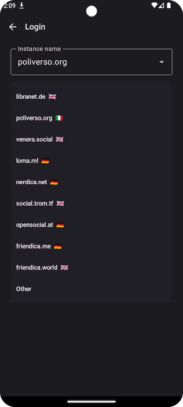

# User manual

Welcome to the User Manual of Raccoon for Friendica! This guide contains an explanation of the most
important features of the app and intends to be an near-exhaustive guide to all what you can (and
can't) do from the app.

## Table of contents

- [Introduction](#introduction)
- [General UI structure](#application-ui-general-structure)
- [Timeline](#timeline)
- [Post detail](#post-detail)
- [Image detail](#image-detail)
- [User profile](#user-profile)
  - [Classic mode](#classic-mode)
  - [Forum mode](#forum-mode)
- [Thread detail](#thread-detail)
- [Hashtag feed](#hashtag-feed)
- [Favorites & Bookmarks](#favorites--bookmarks)
- [Followed hashtags](#followed-hashtags)
- [Explore](#explore)
- [Search](#search)
- [Inbox](#inbox)
- [Profile](#profile)
  - [Login](#login)
  - [One's own user detail](#ones-own-user-detail)
- [User list](#user-list)
- [Follow requests](#follow-requests)
- [Node info](#node-info)
- [App information](#app-information)
- [Profile settings](#profile-settings)
- [Application settings](#application-settings)
- [Filter management](#filter-management)
- [Post composer](#post-composer)
- [Create report](#create-report)
- [Circles](#circles)
- [Direct messages](#direct-messages-friendica-only)
- [Gallery](#gallery-friendica-only)
- [Unpublished items](#unpublished-items)
- [Calendar](#calendar-friendica-only)

## Introduction

**Friendica** is social platform and it has all the features you would expect from a piece of
software
or this category, you can:

- see the timeline of posts created by other users;
- follow an hashtag and see all the posts containing it;
- create new top-level posts or replies to other's posts or schedule them for later (and edit or
  delete your ones);
- like or dislike posts;
- save posts to bookmarks;
- re-share posts;
- follow or unfollow other users, see their profile and subscribe for notifications about their
  activity;
- edit your own profile and accept/reject your follow requests;
- create our customized feeds;
- see trending hashtags, posts or links (and follow suggestions);
- globally search for hashtags, posts or users;
- mute or block users to filter out contents you don't like (and undo these actions);
- report posts and users to administrators, etc.

On top of that, Friendica has a series of interesting features which make it stand out among other
similar federated platforms:

- you can publish long and formatted posts (with a BBCode-based syntax) and add a title for each
  post besides the spoiler;
- it supports ActivityPub's "group" entities, i.e. special kind of accounts which automatically
  re-distribute all contents mentioning them to subscribers and work like forums;
- it has the concept of user-defined lists or _Circles_, which can also be used as a target
  for publication (outbound) and not only as customized feeds (inbound);
- direct messages: you can directly send a message to one of your followed users and have a private
  conversation;
- image gallery: you can upload photos and organize them into albums, moreover you can easily
  insert them into your posts taking them from the catalog;
- event calendar: you can create events and make them visible to your followers or see the events
  that have been shared with you;
- it supports quoting posts inside other posts (AKA _cross-posting_);
- you can import RSS feeds so that you can follow them as regular accounts and re-share their posts;
- you can delegate the management of an account to one or more other accounts and easily create
  independent accounts;
- and, of course, [much more](https://friendi.ca/about/features).

All these features can be accessed using the official web application, but a lot of them are also
open to third-party apps using their public APIs, Raccoon intends to do just that: be a client for
Friendica which makes it easier to use it from a mobile device.

[^ Back](#table-of-contents)

## Application UI general structure

The application UI is divided into three parts:

- the navigation drawer (accessible from the hamburger menu in the top-start corner or with a swipe
  gesture from the start direction), containing your user and instance name if you're logged or just
  the instance name in anonymous mode and a series of shortcuts to different app sections (e.g.
  settings or node info pages);
- the bottom navigation bar, containing shortcuts for the most important app sections (Timeline,
  Explore, Inbox and Profile) which is visible only in top-level screens;
- the main content which usually is structured in the following way:
  - a top bar containing:
    - a navigation icon (the hamburger or back button) in the start corner;
    - the screen title;
    - one or more (optional) actions in the end corner or a drop-down "⋮" menu;
  - the screen content;
  - an optional bottom bar (e.g. formatting toolbar and/or text field).

The totality of the components used come from the [Material 3](https://m3.material.io/) design
system.

[^ Back](#table-of-contents)

## Timeline

The timeline section contains a series of posts that belong to either a default feed or a custom
feed.

There are three default feed types:

- Local (i.e. posts that have been created or re-shared on the instance you are connecting to);
- All (i.e. posts coming from your instance plus all the federated instances);
- Subscriptions (only for logged users: posts created or re-shared by accounts you are following or
  which contain one or more hashtags you are following).

Custom feeds, on the other hand, can be:

- any of your user-defined lists;
- a channel, i.e. predefined aggregations e.g. "For you", "Discover", "Followers", "Images", etc.
  (Friendica-specific);
- any of the groups you are following (Friendica-specific);

Every item in the timeline has the following structure:

- re-share or reply indication (user who re-shared or original poster if the current one is a
  reply);
- author (avatar, display name and username of author);
- creation date;
- title (only from sources which allow it like Friendica or Lemmy);
- spoiler text (optional);
- textual content (visible if no spoiler or spoiler expanded);
- attachments (videos or images);
- card (additional preview content or external URL).

If the content of a post contains a hashtag you will be able to open the
corresponding [screen](#hashtag-feed) and if it contains a mention you will be able to open the
corresponding [profile](#user-profile).

Each post can be re-shared, added to favorites or bookmarked; you can create a reply to each of them
and see the number of replies, re-shares favorites and whether it is in your bookmarks or not.

Moreover, from each single post it is possible to:

- access the [profile](#user-profile) of all users involved (author, re-sharer or original poster);
- enter the [post detail](#post-detail) screen;
- open the a drop-down action menu to:
  - share it via the system share mechanism;
  - copy its URL to the clipboard;
  - copy its title and content to clipboard;
  - mute its author indefinitely or for a limited amount of time;
  - block its author;
  - report it or its author to administrators;
  - quote it (i.e. cross-posting it, Friendica-only);
  - open a "Details" screen with the raw source and additional information;
  - edit or delete it (only if you are the author).

  
  

[^ Back](#table-of-contents)

## Post detail

In this screen you will will be able to see it in its context (with ancestors until the root post
and all descendants).

Moreover you can the list of users who re-shared it or added it to their favorites.

Apart from that, this screen is very similar to a regular [timeline](#timeline), and allows to
perform the same actions and open user profiles or other post details.

  

[^ Back](#table-of-contents)

## Image detail

From a video or image attachment, you can open the full-screen image viewer. For images, use double
tap to enter the pinch-to-zoom mode.

From the top bar action menu, you can download the attachment to your device, share it as a file or
as a URL and, for images, adjust the aspect ratio in case if were not displaying correctly.

  

[^ Back](#table-of-contents)

## User profile

The purpose of the user profile is to display information about a specific user and access the set
of contents they have created. There are two flavours of this screen: _classic mode_ (for regular
users) and _forum mode_ (for group accounts).

### Classic mode

The screen is made up by two parts:

- a header containing display name, username, banner and avatar, number of following/followers (from
  which you can open the user list), bio and custom fields;
- the list of posts created by the user, which has the following sections:
  - **Posts** list of top-level posts by the user;
  - **Posts & replies** all posts including replies by the user;
  - **Media** posts containing media attachments;
  - **Pinned** posts pinned by the user to their profile;

Each item of these lists allows you to access its [post detail](#post-detail).

If you are logged, the headers shows the relationship your user has with this user:

- mutual followers;
- you follow them;
- they follow you;
- you sent a follow request which is pending;
- you received a follow request from them which is pending;
- no relation.

If you follow the user, you will also see the notification status (enabled or disabled).

From the top app bar action menu, you can also:

- block/unblock the user;
- mute/unmute the user (and specify for how much time);
- report the user;
- add a personal note on the user;
- switch to [forum mode](#forum-mode) (if it is a group).

  

### Forum mode

In forum mode, you will be presented with all the top-level posts that have been re-shard by the
group, i.e. the list of topics of this forum. This is a special kind of timeline, by tapping on each
item you will enter the [thread detail](#thread-detail).

From the top app bar action menu, you can also switch to [classic mode](#classic-mode).

  

[^ Back](#table-of-contents)

## Thread detail

This screen is similar to a [post detail](#post-detail) but comments are displayed in a Lemmy-like
layout, i.e. indented according to their nesting level and with a coloured bar which makes it easier
to distinguish parent-child relationship between replies.

  

[^ Back](#table-of-contents)

## Hashtag feed

The hashtag feed is a special kind of [timeline](#timeline) featuring all the posts containing a
given hashtag and it follows the same structure.

From the top app bar, you will be able to follow or unfollow the hashtag.

  

[^ Back](#table-of-contents)

## Favorites & bookmarks

Favorites and bookmarks are special kinds of [timelines](#timeline) and they follow the same
structure.

The only difference is that if you un-favorite or un-bookmark a post it will immediately disappear
from the feed.

  
  

[^ Back](#table-of-contents)

## Followed hashtags

This screen contains the list of all hashtags you are following in alphabetical order, and you can
unfollow each one of them.

Each item of this list allows to open the corresponding [feed](#hashtag-feed).

  

[^ Back](#table-of-contents)

## Explore

This section allows you to see the most trending content in the instance you are connected to. The
screen is divided into the following sections:

- **Hashtags** contains the list of trending hashtags, with the number of people talking about it
  and a
  chart about its usage in the last week;<a href="#hashtag-usage-disclaimer">*</a>
- **Posts** list of treding posts
- **Links** aggregated view of the URLS used most frequently in posts;
- (only for logged users) **For you** contains the list of follow suggestions for your user.

Opening a hashtag will lead you to the [dedicated feed](#hashtag-feed), opening a post to
its [detail](#post-detail) and opening a user to the corresponding [profile](#user-profile). Opening
a link will either open the external browser or custom tabs depending on the "URL opening mode"
option selected in the [app settings](#application-settings).

  * note that on different backends the number or days may vary from 1 (single point) to more

  
  

[^ Back](#table-of-contents)

## Search

This screen makes it possible to search in the Fediverse: it contains a search field to enter the
query string and a tab selector to choose the desired result type (either Posts, Users or Hashtags).

Please notice that it is not possible to search unless a non-empty query has been inserted.

Opening a hashtag will lead you to the [dedicated feed](#hashtag-feed), opening a post to
its [detail](#post-detail) and opening a user to the corresponding [profile](#user-profile).

  

[^ Back](#table-of-contents)

## Inbox

This screen contains the list of notifications for the events you have subscribed to, so it is only
available for logged users.

The main content presents the list of notifications, which can be of the following types:

- **Post** a user you enabled notifications for has published a new post;
- **Edit** a post you have re-shared has been modified by its author;
- **Mention** you have been mentioned in a post;
- **Re-share** one of your posts has been re-shared;
- **Favorite** one of your posts has been added to favorites;
- **Follow** someone has started following you;
- **Follow request** someone has sent you a follow request;
- **Poll** a poll you have participated in has expired.

From the top bar menu it is possible to select/unselect specific categories of notifications to
filter the results displayed in the list.

Moreover, it is possible to:

- mark all notifications as read, by simply refresh the page (which will reset the unread counter);
- dismiss all notifications by using the "Done all" button in the top bar.

(Be careful, after being dismissed notifications are cleared from the server and you will not be
able to browse the list any more!)

Tapping on each item of the list, it is possible to open the [user profile](#user-profile)
or [post detail](#post-detail).

  

[^ Back](#table-of-contents)

## Profile

If you are running the app in anonymous mode, the Profile screen contains the Login button to start
the authentication flow. If, on the other hand, you are already logged in, it looks similar to a
regular [user profile](#user-profile) but has some additional actions specific for your user.

If you have multiple accounts, in the top app bar you will find a "Manage account" button to switch
between one another.

### Login

There are two possible ways to login, depending on your preferences (or what your backend allows):

- **OAuth2** (recommended) web-based flow, a browser tab will be opened to log-in and a
  client-specific token allowing the app to operate on the user's behalf will be generated;
- **HTTP Basic** (legacy, available on Friendica) this in-app flows involves selecting the instance
  and inserting your credentials, all API calls will be using HTTP Basic auth header.

Needless to say — but we'll repeat it for the sake of clarity — the recommended way to login is
OAuth2 because:

- your username/password never go outside browser and remain unknown to all third-party subjects
  (including the Raccoon app);
- it has finer-grained access levels, meaning you can control the various _scopes_ each individual
  token can be used for;
- tokens can be revoked at any time, making it easier to mitigate potentially unwanted accesses.

  
  

### One's own user detail

In the header, instead of the relationship/notification buttons you will find an "Edit profile"
button to open your [profile preferences](#profile-settings).

  

[^ Back](#table-of-contents)

## User list

This screen contains a generic list of users; it can be opened either from
the [post detail](#post-detail) (to see who added a post to favorites or re-shared it) or from
the [user profile](#user-profile) (to see who is following or followed by a given user). It displays
the avatar, display name and username of users plus the corresponding relationship status.

You can use the follow/send request/mutuals button to modify your relationship with the given
account.

  

[^ Back](#table-of-contents)

## Follow requests

If in your [profile settings](#profile-settings) you have enabled manual approval for follow
requests, this screen contains the list of pending follow request you have received.

For each one of the items you can either accept or reject the request.

  

[^ Back](#table-of-contents)

## Node info

This screen contains some information about the current instance you are connected to:

- banner image;
- domain;
- description;
- contact account;
- list of rules members of this server have to comply with;
- backend type and software version.

  

[^ Back](#table-of-contents)

## App information

This dialog contains more information about the app:

- version name and code;
- a link to the changelog;
- a button to open a feedback form;
- a link to the GitHub main page of the app;
- a shortcut to the Friendica discussion group for the app;
- a link to the project's Matrix room;
- the entry point for the list of licences for the libraries and resources used in the app.

  
  

[^ Back](#table-of-contents)

## Profile settings

This screen allows you to edit your profile data and configure (to some extent) the discoverability
and visibility of your profile.

The profile data which can be edited are:

- display name;
- bio;
- avatar;<a href="#user-profile-experimental-disclaimer">*</a>
- banner;<a href="#user-profile-experimental-disclaimer">*</a>
- custom fields;<a href="#user-profile-experimental-disclaimer">*</a>
- bot (mark account as bot);
- manual approval of follow requests (`locked`);
- make account visible in searches (`discoverable`);
- make following and follower lists private (`hide_collections`);
- include posts by this account in public timeline (`indexable`).

  * depending on the back-end type these fields may not work, e.g. there are some known compatibility
issues on some versions of Friendica

  

[^ Back](#table-of-contents)

## Application settings

This screen allows to customize the application appearance and behaviour, it has the following
sections:

- **General**
  - **Language**  configures the language for the user interface;
  - **Default timeline type** configures the timeline type used by default in the Timeline screen
  - **Default visibility for posts** configures the visibility (`public`, `unlisted`, `private` -
    i.e. only followers — or `direct` — i.e. ony mentions) used for posts by default;
  - **Default visibility for replies** configures the visibility used for replies by default;
  - **URL opening mode** configures how URLs will be opened (external browser or custom tabs);
  - **Exclude replies from timeline** configures whether replies are included by default in the
    Timeline screen;
  - **Open groups in forum mode** by default configures whether group accounts are going to be
    opened in forum mode (as opposed to classic mode) by default;
  - **Markup for compositing** determines the type of markup syntax used in new posts (plain text —
    i.e. no markup — BBCode — Friendica-specific — HTML or Markdown — Mastodon specific);*
  - **Max post body lines** configures the maximum number of lines for posts which will be shown in
    feeds;
  - **Check for notifications in background** configures the time interval between background checks
    for incoming notifications;
- **Look & Feel**
  - **UI theme** configures the color theme (light, dark or dark optimized for AMOLED screens);
  - **Font family** configures the font used in the UI;
  - **Font size** configures the scale factor applied to fonts in the UI
  - **Theme color** allows to choose a color to generate a Material 3 palette from;
  - **Material You** generate a color palette based on the launcher image;
- **NSFW**
  - **Manage filters** opens the ban and [filter management](#manage-filters) screen;
  - **Include NSFW contents** configures a client-side filter to exclude sensitive posts;
  - **Blur NSFW media** allows, if sensitive contents are included, to blur images and hide videos
    when they occur in timelines.

  

[^ Back](#table-of-contents)

## Filter management

This screen allows to revoke current restrictions on other accounts. It is divided into two
sections:

- **Muted** for muted accounts;
- **Bans** for banned ones.

  

[^ Back](#table-of-contents)

## Post composer

This screen allows to create new posts or replies. The top bar contains the Submit button which can
have different icons depending on the publishing type:

- a Send icon for regular publication;
- a Save icon for drafts;
- a Schedule icon for scheduled posts;

whereas the action menu contains the following items:

- **Save draft** changes the publishing type from regular to draft;
- **Set schedule** changes the publishing type from regular to scheduled posts;
- **Insert emoji** allows to insert a custom emoji;
- **Open preview** opens a preview of the post (only if "Markup for compositing" option in Settings
  is
  _not_ plain text);
- **Add title**/**Remove title** to add or remove a title for the post;
- **Add image (media gallery)** adds an image from an album in the Friendica media gallery;
- **Insert list** adds an itemized list;
- **Add spoiler**/**Remove spoiler** (only if "Markup for compositing" option in Settings is plain
  text) to add or remove a spoiler for the post;
- **Add image** (only if "Markup for compositing" option in Settings is plain text) adds an image
  from
  the device gallery;

Below the top bar there is a header containing:

- an indication of the current user (who will be the author of the post);
- the visibility (`public`, `unlisted`, `private`, `direct` or a Friendica circle);
- the schedule date and time (for scheduled posts);
- the current character count / character limit according to instance configuration.

Below the header you can find the main text field for the post body. In the bottom part of the
screen, only if "Markup for compositing" option in Settings is _not_ plain text, you will find a
formatting toolbar with the following buttons:

- **Add image** to add an image from the device gallery;
- **Add link** to add a hyperlink
- **Bold** to insert some text in bold;
- **Italic** to insert some text in italic;
- **Underline** to insert some underlined text;
- **Strikethrough** to insert some text with a strikethrough effect;
- **Code** to insert monospaced font;
- **Toggle spoiler** to add or remove a spoiler for the post.

  

[^ Back](#table-of-contents)

## Create report

This screen allows to create a report for either a user or a specific post.

It contains a selector to choose the kind of violation among:

- **Spam** the post is spam or user is spamming;
- **Legal** issue the post or user infringes some existing legislation;
- **Rule** (Mastodon-only) the post or user does not follow the instance rules (in this case you
  will have to select which rule is violated);<a href="#report-rule-disclaimer">*</a>
- **Other** any other kind of issue.

Below you can write the report body in a text field and, finally, the "Forward report" switch allows
you to select whether this report should only be delivered to your instance admins or, if you are
reporting a content coming from a federated instance, it should be handled by the admins of the
source instance too.<a href="#report-forward-disclaimer">**</a>

* on Friendica rule violation are not supported yet and if they are submitted they get rejected by
the server, so this option is hidden

** on Friendica this switch is supported (does not cause the request to be rejected by the server)
but it has no effect

  

[^ Back](#table-of-contents)

## User feedback

This form allows you to submit your feedback to the developers. Apart from writing your comment, you
can optionally specify an email address (e.g. if you wish to be contacted for clarifications). This
is just a utility screen for those who prefer not to use the issue tracker.

  

[^ Back](#table-of-contents)

## Circles

This screens contains all the custom feeds that can be used in the timeline, which comprise:

- user-defined lists (like Mastodon lists or
  Friendica [circles](https://wiki.friendi.ca/docs/groups-and-privacy));
- Friendica [channels](https://wiki.friendi.ca/docs/channel);
- one item for each group among the accounts you follow.

> The reason why all these heterogeneous elements are in the same list is because they are all
> returned by the same API for compatibility with Mastodon clients.

Among these three categories, the only one which allow to be modified is the first one, for which:

- you can use the "more" button to edit the name or delete it
- you can enter a circle detail screen to see the contacts that belong to it.

Please remember that in Friendica by default all non-group contacts are added to the "Friends"
circle and all group contacts are added to "Group" but, albeit being there by default, these are
regulars circles that can be changed or deleted.

  
  

[^ Back](#table-of-contents)

## Direct messages (Friendica-only)

This section contains the list of private conversations with your contacts. For each
item in the list, you can see:

- the contact avatar, username and display name;
- the title of the conversation (defaulting to the first message);
- some lines of the last message;
- the total number of messages;
- the time elapsed since the last message was received.

Tapping on each item you can open the conversation detail, in the form of a traditional hat with
message bubbles and a text field in the bottom part of the screen to send new ones.

Messages are being downloaded as long as they arrive while you are in this screen, otherwise you
have to manually refresh the conversation list.

  
  

[^ Back](#table-of-contents)

## Gallery (Friendica-only)

This screen contains the list of albums in your multimedia gallery. For each album you can either
edit its name or delete it or, tapping on the list item, access the pictures contained in it.

For each picture, you will have the possibility to:

- edit its description;
- delete it from the Gallery;
- move it to another album.

  
  

[^ Back](#table-of-contents)

## Unpublished items

This screen contains all the items awaiting publication and it is divided into two sections:

- scheduled i.e. the list scheduled posts;
- drafts i.e. the list of drafts you created;

each item can be deleted or, by tapping on it, opened in edit mode.

Beware that on most instances scheduled posts can **not** be modified except for their schedule
date, so the preferred way to save a post and edit for later is:

- create a post with the "Only mentions" (`direct`) visibility without mentioning any user so that
  it is only visible to you;
- create a draft, keeping in mind that draft are just **local records** saved in the application
  database and are not stored anywhere remotely, so will lose them if you change device or clear the
  application storage.

  

[^ Back](#table-of-contents)

## Calendar (Friendica-only)

This screen shows the event calendar, i.e. the list of events divided by month with, for each item:

- event title
- start date;
- (optional) end date;
- (optional) location.

For each item, you can export it to your device calendar and, by tapping on the item, access a
detail screen where more details (like a more extended description) are displayed.

  
  

[^ Back](#table-of-contents)
